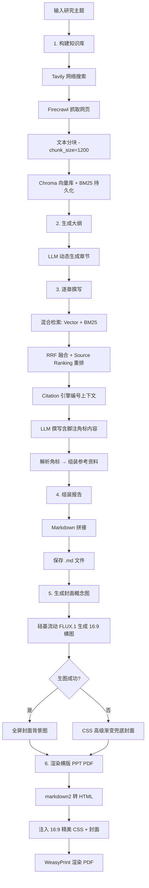

# 🔬 Research Agent

> AI 驱动的行业研究报告自动生成系统 —— 从信息搜集、知识检索到精美排版 PDF，全流程自动化。支持 Web 管理界面与异步任务队列，三栏式交互工作台。

[](https://www.python.org/)
[](https://fastapi.tiangolo.com/)
[](https://docs.celeryq.dev/)
[](https://react.dev/)
[](https://vitejs.dev/)
[](https://www.langchain.com/)
[](https://www.trychroma.com/)
[](LICENSE)

---

## 📖 项目简介

Research Agent 自动完成行业研究报告的端到端生成：输入一个研究主题，系统自动执行网络搜索、网页内容抓取、本地知识库构建、大纲规划、逐章深度撰写、学术级引用溯源，最终输出专业排版的 Markdown 和 **16:9 横版 PPT 风格 PDF**。

系统包含三大组件：

- **🧠 研究引擎** (`app/`) — 核心的 RAG 管道与报告生成逻辑
- **⚙️ 后端服务** (`backend/`) — FastAPI REST API + Celery 异步任务队列 + SQLite/PostgreSQL 持久化
- **🎨 前端界面** (`frontend/`) — React + Vite + TypeScript + Tailwind CSS + Shadcn UI 管理面板

### 核心能力

- 🔍 **自动信息搜集** — 调用 Tavily 搜索引擎获取最新行业资讯
- 🕷️ **网页内容抓取** — 通过 Firecrawl 将网页转为结构化 Markdown
- 📚 **双引擎知识库** — Chroma 向量检索 + BM25 关键词检索混合召回
- 🧠 **AI 深度撰写** — DeepSeek 大模型基于检索资料撰写专业研报
- 📎 **学术级引用溯源** — 自动编号、角标嵌入、参考资料章节
- 🎯 **信息源分级排序** — 区分权威来源与 UGC 内容，自动加权排序
- 🎨 **多模态概念图** — 硅基流动 FLUX.1 自动生成产品概念设计图
- 📄 **横版 PPT 风格 PDF** — WeasyPrint 渲染，16:9 宽屏比例，沉浸式封面 + 单页单主题排版
- 🖥️ **实时运行日志** — 终端控制台风格时间轴，Agent 每一步执行动作实时可见
- 🔄 **交互式状态机** — 资料审核 → 大纲确认 → AI 撰写 → PDF 下载，支持断点干预
- 🌐 **三栏式工作台** — 大纲目录 + 块级编辑器 + 实时日志/引用溯源面板
- ⚡ **异步任务队列** — Celery + Redis 支撑的异步报告生成管道

---

## 🏗️ 完整架构

```
research_agent/
│
├── app/                                    # 🧠 核心研究引擎
│   ├── orchestrator/workflow.py            #    全流程入口
│   ├── planner/                            #    规划层
│   │   ├── outline_generator.py            #      大纲生成
│   │   ├── query_planner.py                #      检索词规划
│   │   └── compare_query.py                #      检索策略对比
│   ├── search/tavily_search.py             #    🔍 Tavily 搜索
│   ├── crawler/firecrawl_crawler.py        #    🕷️ Firecrawl 抓取
│   ├── rag/                                #    📚 检索增强生成
│   │   ├── chunker.py                      #      文本分块
│   │   ├── vector_store.py                 #      Chroma + BM25
│   │   ├── retriever.py                    #      混合检索
│   │   ├── citation_utils.py               #      引用引擎
│   │   └── rag_pipeline.py                 #      知识库管道
│   ├── report/                             #    📄 报告生成
│   │   ├── section_writer.py               #      章节撰写
│   │   ├── markdown_formatter.py           #      Markdown 组装
│   │   └── pdf_generator.py                #      横版 PPT PDF 渲染
│   ├── llm/                                #    🤖 大模型接口
│   │   ├── client.py                       #      DeepSeek + 硅基流动 FLUX.1
│   │   └── client01.py                     #      本地 Qwen2.5 备用
│   └── context/context_builder.py          #    上下文处理
│
├── backend/                                # ⚙️ FastAPI 后端服务
│   ├── app/
│   │   ├── main.py                         #    FastAPI 入口
│   │   ├── core/
│   │   │   ├── config.py                   #    配置管理 (Pydantic Settings)
│   │   │   ├── database.py                 #    数据库引擎
│   │   │   ├── celery_app.py               #    Celery 应用
│   │   │   └── celery_db.py                #    Celery DB 会话 + 业务日志
│   │   ├── api/v1/
│   │   │   ├── router.py                   #    路由注册
│   │   │   └── endpoints/
│   │   │       ├── projects.py             #    项目 REST API + 日志 API
│   │   │       └── editor.py               #    Inline AI 编辑 API
│   │   ├── models/                         #    SQLAlchemy ORM
│   │   │   ├── project.py                  #      项目模型 + 状态机枚举
│   │   │   ├── task.py                     #      任务模型
│   │   │   ├── document.py                 #      文档模型
│   │   │   ├── document_block.py           #      文档块模型 (Tiptap)
│   │   │   └── project_log.py              #      🆕 业务时间轴日志模型
│   │   ├── schemas/                        #    Pydantic 数据模型
│   │   └── tasks/                          #    Celery 异步任务
│   │       ├── report_workflow.py          #      工作流编排 (3阶段交互式)
│   │       ├── search_tasks.py             #      搜索任务
│   │       ├── knowledge_tasks.py          #      知识库任务
│   │       ├── writing_tasks.py            #      撰写任务
│   │       └── render_tasks.py             #      渲染 + 封面生图任务
│   ├── outputs/                            #    报告输出目录
│   ├── alembic/                            #    数据库迁移
│   ├── local_dev.db                        #    SQLite 开发数据库
│   ├── Dockerfile
│   └── docker-compose.yml
│
├── frontend/                               # 🎨 React 前端界面
│   ├── src/
│   │   ├── App.tsx                         #    路由配置
│   │   ├── main.tsx                        #    入口
│   │   ├── pages/
│   │   │   ├── DashboardPage.tsx           #    控制台 · 项目创建与列表
│   │   │   ├── ProgressPage.tsx            #    进度追踪（旧版兼容）
│   │   │   ├── WorkspacePage.tsx           #    🆕 三栏式交互工作台
│   │   │   └── ReportPage.tsx              #    报告阅读器
│   │   ├── components/
│   │   │   ├── layout/
│   │   │   │   ├── Layout.tsx              #    全局布局
│   │   │   │   ├── Sidebar.tsx             #    侧边栏导航
│   │   │   │   └── ThreePaneLayout.tsx     #    🆕 三栏响应式布局
│   │   │   ├── projects/
│   │   │   │   ├── CreateProjectModal.tsx  #    创建项目弹窗
│   │   │   │   ├── ProjectCard.tsx         #    项目卡片
│   │   │   │   ├── ProgressTracker.tsx     #    进度跟踪组件
│   │   │   │   ├── SourcesReview.tsx       #    🆕 资料审核面板
│   │   │   │   ├── OutlineApproval.tsx     #    🆕 大纲确认面板
│   │   │   │   └── TerminalTimeline.tsx    #    🆕 实时运行日志终端
│   │   │   ├── editor/
│   │   │   │   ├── BlockEditor.tsx         #    Tiptap 块级编辑器
│   │   │   │   ├── InlineAIBubble.tsx      #    行间 AI 悬浮菜单
│   │   │   │   ├── DiffViewNode.tsx        #    Diff 差异对比组件
│   │   │   │   └── extensions/
│   │   │   │       └── Citation.tsx        #    引用角标交互组件
│   │   │   ├── report/CitationMarkdown.tsx #    可交互报告渲染
│   │   │   └── common/                     #    Shadcn UI 组件
│   │   ├── hooks/
│   │   │   ├── useProjects.ts              #    React Query hooks (旧版)
│   │   │   ├── useProjectStatus.ts         #    🆕 状态机感知轮询 + 乐观更新
│   │   │   ├── useProjectLogs.ts           #    🆕 增量日志拉取
│   │   │   ├── useEditorSync.ts            #    🆕 编辑器 SSE 同步
│   │   │   ├── useDraftStream.ts           #    🆕 SSE 草稿流
│   │   │   └── useCitationStore.ts         #    🆕 引用溯源状态
│   │   ├── lib/api.ts                      #    Fetch API 客户端
│   │   └── types/
│   │       ├── api.ts                      #    TypeScript 类型定义
│   │       └── index.ts                    #    工作台类型
│   ├── index.html
│   ├── vite.config.ts
│   ├── tailwind.config.ts
│   └── package.json
│
├── tests/                                  # 🧪 评测脚本
│   ├── eval_retrieval.py
│   ├── eval_ranking.py
│   └── eval_citation.py
│
├── backend/tests/
│   └── test_api_integration.py             # 11 个集成测试 (10/11 PASS)
│
├── chroma_db/                              # 向量数据库持久化
├── bm25_db/                                # BM25 语料持久化
├── outputs/                                # CLI 模式输出
├── requirements.txt                        # 核心依赖
└── .env                                    # API 密钥
```

---

## 🚀 安装方式

### 环境要求

- Python 3.10+
- Node.js 18+
- Redis 6+（Celery 任务队列）
- pip / npm

### 安装步骤

```bash
# 1. 克隆项目
git clone <repo-url>
cd research_agent

# 2. 安装 Python 依赖
pip install -r requirements.txt
pip install -r backend/requirements.txt

# 3. 安装前端依赖
cd frontend && npm install && cd ..

# 4. 配置 API 密钥（创建 backend/.env 文件）
# 复制并编辑 backend/.env，填入你的 API Key：
#   DEEPSEEK_API_KEY=sk-your-deepseek-key
#   TAVILY_API_KEY=tvly-your-tavily-key
#   FIRECRAWL_API_KEY=fc-your-firecrawl-key
#   SILICONFLOW_API_KEY=sk-your-siliconflow-key  (可选，封面生图用)

# 5. 数据库自动创建（首次启动时 FastAPI 自动建表，无需手动迁移）
```

### API 密钥获取

| 服务 | 用途 | 获取地址 |
|------|------|----------|
| DeepSeek | 大模型文本生成 | https://platform.deepseek.com |
| Tavily | 网络搜索 | https://tavily.com |
| Firecrawl | 网页内容抓取 | https://firecrawl.dev |
| SiliconFlow | FLUX.1 封面概念图（可选） | https://siliconflow.cn |

---

## 🎬 启动系统

### 完整启动（推荐）

需要 4 个终端窗口：

```bash
# 终端 1: 启动 Redis（如未运行）
redis-server

# 终端 2: 启动 FastAPI 后端（端口 8080）
cd research_agent/backend
uvicorn app.main:app --host 0.0.0.0 --port 8080 --reload

# 终端 3: 启动 Celery Worker
cd research_agent/backend
celery -A app.core.celery_app worker -l info --pool=solo

# 终端 4: 启动前端 Vite 开发服务器
cd research_agent/frontend
npm run dev
```

### 本地浏览器访问

| 服务 | 地址 |
|------|------|
| **前端界面** | **http://localhost:5173** |
| API 文档 (Swagger) | http://localhost:8080/docs |
| 健康检查 | http://localhost:8080/health |

### 快速命令行测试（无需启动前端）

```bash
cd research_agent
python app/orchestrator/workflow.py
```

在 [`workflow.py`](app/orchestrator/workflow.py) 底部修改 `topic` 变量：

```python
if __name__ == "__main__":
    topic = "AI眼镜行业"          # 修改这里
    run_workflow(topic)
```

---

## 🌐 API 接口文档

| 方法 | 路径 | 说明 |
|------|------|------|
| `POST` | `/api/v1/projects` | 创建新研究项目 |
| `GET` | `/api/v1/projects` | 获取项目列表 |
| `GET` | `/api/v1/projects/{id}/status` | 查询项目进度与任务状态（含 `current_step`） |
| `GET` | `/api/v1/projects/{id}/sources` | 🆕 获取资料列表（交互节点1） |
| `POST` | `/api/v1/projects/{id}/review-sources` | 🆕 提交资料审核（交互节点1确认） |
| `POST` | `/api/v1/projects/{id}/approve-outline` | 🆕 确认大纲（交互节点2） |
| `GET` | `/api/v1/projects/{id}/blocks` | 🆕 获取文档块列表 |
| `GET` | `/api/v1/projects/{id}/content` | 🆕 获取报告全文内容 |
| `GET` | `/api/v1/projects/{id}/logs` | 🆕 获取实时运行日志（支持增量拉取） |
| `GET` | `/api/v1/projects/{id}/stream-draft` | 🆕 SSE 流式草稿输出 |
| `GET` | `/api/v1/projects/{id}/download` | 下载生成的 PDF 报告文件 |
| `POST` | `/api/v1/editor/revise` | 🆕 Inline AI 划词改写 |
| `GET` | `/health` | 健康检查 |

### 创建项目示例

```bash
curl -X POST http://localhost:8080/api/v1/projects \
  -H "Content-Type: application/json" \
  -d '{"topic": "智能手表产品分析"}'
```

### 查询进度

```bash
curl http://localhost:8080/api/v1/projects/{project_id}/status
```

返回状态含任务进度、当前执行步骤和实时日志：

```json
{
  "project_id": "...",
  "topic": "智能手表产品分析",
  "project_status": "drafting",
  "current_step": {
    "step": "writing_section",
    "message": "✍️ 正在撰写「1. 产品设计理念」(1/6)...",
    "icon": "✍️",
    "level": "info"
  },
  "progress": {
    "total_tasks": 9,
    "completed_tasks": 4,
    "failed_tasks": 0,
    "percentage": 44.4
  }
}
```

---

## 🎨 前端页面

### 1. Dashboard (`/`)
- 创建新的研究项目（输入主题）
- 查看已有项目列表（状态、进度、时间）
- 一键进入工作台或报告阅读

### 2. 三栏式工作台 (`/workspace/:projectId`) 🆕
- **左栏**：大纲目录树，点击章节快速导航
- **中栏**：ProgressTracker 进度条 + 状态卡片 + Tiptap 块级编辑器
  - 资料审核面板（交互节点1）
  - 大纲确认面板（交互节点2）
  - BlockEditor 流式撰写展示
- **右栏**：多功能面板
  - **🖥️ 实时运行日志**：终端控制台风格时间轴，彩色编码（蓝=信息/绿=里程碑/黄=警告/红=错误），新日志到达自动滚动
  - 引用溯源面板
  - AI 助手面板

### 3. 报告阅读器 (`/report/:projectId`)
- Markdown 报告实时渲染
- **引用溯源气泡**：点击 `[^1]` 角标弹出浮层显示参考资料详情
- 下载按钮（PDF / MD）

---

## 🔄 工作流说明

### 交互式三阶段状态机 🆕

```
PREPARING_DATA ──(自动)──→ WAITING_FOR_SOURCES  🛑 用户审核资料
                                 │
                    POST /review-sources
                                 │
                                 ↓
                       PREPARING_OUTLINE ──(自动)──→ WAITING_FOR_OUTLINE  🛑 用户确认大纲
                                                           │
                                              POST /approve-outline
                                                           │
                                                           ↓
                                                     DRAFTING ──(自动)──→ COMPLETED ✅
```

### 报告生成流程



### 关键机制详解

#### 混合检索
同时执行两种互补检索策略：
- **向量检索**（Chroma）— 利用 `bge-small-zh-v1.5` 捕捉语义相似度
- **关键词检索**（BM25 + Jieba 分词）— 精确匹配专有名词和技术术语

#### RRF 融合排序
采用 Reciprocal Rank Fusion 算法融合两路结果，同时引入 **Source Ranking** 信息源分级权重：

| 级别 | 权重 | 来源类型 | 示例 |
|------|------|----------|------|
| T0 | ×1.5 | PDF 报告、政府网站、交易所 | `.pdf`, `.gov`, `sse.com.cn` |
| T1 | ×1.2 | 专业商业媒体、深度研报 | `36kr.com`, `caixin.com`, `huxiu.com` |
| T2 | ×1.0 | 普通新闻网站 | 默认 |
| T3 | ×0.5 | UGC 社区、自媒体 | `zhihu.com`, `weibo.com`, `xiaohongshu.com` |

#### 引用溯源
1. **阶段一**：URL 去重编号，同一来源的多个 Chunk 共享一个编号
2. **阶段二**：LLM 在正文中使用 `[^n]` 格式的脚注角标
3. **阶段三**：正则解析所有使用过的编号，自动在文末拼接「参考资料」章节

#### 封面概念图生成 🆕
1. 调用硅基流动 FLUX.1-schnell 模型生成 16:9 横版概念图（1024×576）
2. 超时保护（连接 15s + 读取 120s）+ 指数退避重试
3. **兜底策略**：生图失败自动降级为 CSS 多层科技感渐变背景
4. 零崩溃保证——生图异常不影响 PDF 终稿交付

---

## 📊 输出结果示例

运行完成后，在 `backend/outputs/` 或 `outputs/` 目录生成以下文件：

```
outputs/
├── {topic}_report_{timestamp}.md      # Markdown 报告（含引用角标）
├── {topic}_report_{timestamp}.pdf     # 16:9 横版 PPT 风格 PDF
├── {topic}_report_{timestamp}.html    # 中间 HTML 文件
└── images/
    └── {topic}_concept.png            # 产品概念设计图（16:9 横版）
```

---

## 🧪 评测体系

项目内置三套自动化评测脚本 + 11 个后端集成测试：

| 脚本 | 评测目标 | 对比维度 |
|------|----------|----------|
| `eval_retrieval.py` | 检索质量 | 纯向量检索 vs 混合检索（Vector + BM25 + RRF） |
| `eval_ranking.py` | 排序公平性 | 无权重 RRF vs 加权 Source Ranking RRF |
| `eval_citation.py` | 引用准确性 | URL 去重编号、角标解析、参考资料组装 |
| `test_api_integration.py` | API 集成测试 | 11 个测试用例，覆盖全部端点 + 状态机流转 |

运行方式：

```bash
cd research_agent

# 评测脚本
python tests/eval_retrieval.py
python tests/eval_ranking.py
python tests/eval_citation.py

# 集成测试
cd backend && python -m pytest tests/test_api_integration.py -v
```

---

## 🗺️ 后续规划

- [x] **16:9 横版 PPT 风格 PDF** — 320mm×180mm 宽屏比例，h2 强制分页翻页效果
- [x] **交互式状态机** — 资料审核 → 大纲确认 → AI 撰写三阶段交互流程
- [x] **实时运行日志** — 终端控制台风格时间轴，Agent 执行动作实时可见
- [x] **封面生图兜底** — CSS 高级渐变背景，确保生图失败时 PDF 正常交付
- [x] **前后端状态同步** — 乐观状态更新 + 过渡态 UI 锁定，消除状态闪烁
- [ ] **动态大纲生成** — LLM 根据主题自动规划章节（当前为固定 6 章节模板）
- [ ] **多模型适配** — 抽象 LLM Provider 接口，支持 OpenAI / Claude / 本地模型切换
- [ ] **本地搜索增强** — 支持 SearXNG 等自部署搜索引擎，降低 API 依赖
- [ ] **增量知识库更新** — 避免每次运行都重建整个向量库
- [ ] **报告模板自定义** — 支持用户自定义章节结构和排版风格
- [ ] **用户认证系统** — 添加 JWT 认证，支持多用户隔离

---

## 📅 每日工作日志 / Daily Changelog

> 记录每日功能更新与待优化内容。

### 2026-06-02 / June 2, 2026 — 全栈体验优化 🎯

#### ✨ 功能更新 / Feature Updates

| # | 更新内容 | 文件/模块 | 说明 |
|---|---------|-----------|------|
| 1 | 🔄 **修复前后端状态机流转不同步** | [`useProjectStatus.ts`](frontend/src/hooks/useProjectStatus.ts), [`WorkspacePage.tsx`](frontend/src/pages/WorkspacePage.tsx) | 引入乐观状态更新机制：用户点击「确认大纲」后 UI 立即进入 drafting 态，消除轮询延迟导致的闪烁。新增 `setOptimisticStatus`/`clearOptimisticStatus` 全局过渡态管理，mutation `onMutate` 触发乐观过渡，`onError` 回退，1.5s 高频轮询快速确认真实状态。 |
| 2 | 🖥️ **侧边栏实时运行日志透出** | [`project_log.py`](backend/app/models/project_log.py), [`TerminalTimeline.tsx`](frontend/src/components/projects/TerminalTimeline.tsx), [`report_workflow.py`](backend/app/tasks/report_workflow.py) | 后端新增 `ProjectLog` 模型 + `GET /{id}/logs` 增量拉取 API。Celery 工作流 19 个关键节点注入业务日志（🔍搜索/📚向量库/📝大纲/✍️撰写/📄排版/📕PDF）。前端右侧面板实现深色终端控制台风格 `TerminalTimeline` 组件，彩色编码时间轴（蓝=信息/绿=里程碑/黄=警告/红=错误），新日志到达自动滚动。`ProgressTracker` 实时显示 `current_step` 消息。 |
| 3 | 📄 **PDF 彻底改造为横版 PPT 风格** | [`pdf_generator.py`](app/report/pdf_generator.py) | 重写 WeasyPrint CSS：16:9 宽屏比例（320mm×180mm），PPT 级大字号体系（正文 14pt/h2 20pt/h3 16pt），`h2 { page-break-before: always }` 实现幻灯翻页效果，页眉章节导航+页脚页码，专业品牌色彩系统，全面使用 Block 布局而非 flex/grid。 |
| 4 | 🎨 **修复封面生图失败问题 + 横版适配** | [`client.py`](app/llm/client.py), [`render_tasks.py`](backend/app/tasks/render_tasks.py) | 增强 `generate_image()` 韧性：双超时保护（连接 15s+读取 120s），指数退避重试，JSON/网络/磁盘全异常覆盖，强制 16:9 横版（1024×576）。`render_tasks.py` 在 PDF 渲染前自动调用生图 API，失败不崩溃——自动降级为 CSS 多层渐变兜底封面（深空灰+蓝紫光晕科技感）。 |

#### 🎯 代码统计

| 类别 | 新增 | 修改 |
|------|------|------|
| 后端模型 | `ProjectLog` (1 新文件) | `models/__init__.py` |
| 后端 API | `GET /logs` 端点 | `projects.py`, `schemas/__init__.py` |
| 后端任务 | 19 处日志埋点 | `report_workflow.py`, `celery_db.py` |
| PDF 渲染 | 完全重写 CSS | `pdf_generator.py` (130→300 行) |
| 图像生成 | 全面增强错误处理 | `client.py` |
| 前端组件 | `TerminalTimeline.tsx` (1 新文件) | `WorkspacePage.tsx`, `ProgressTracker.tsx` |
| 前端 Hooks | `useProjectLogs.ts` (1 新文件) | `useProjectStatus.ts` (重写) |
| 前端类型 | 3 个新接口 | `api.ts`, `index.ts` |
| 测试 | — | 集成测试 10/11 PASS |

---

### 2026-05-29 / May 29, 2026

<details>
<summary>展开查看详细日志</summary>

#### ✨ 功能更新

| # | 更新内容 | 文件/模块 | 说明 |
|---|---------|-----------|------|
| 1 | 🧪 **"新能源汽车"主题全流程测试通过** | [`backend/outputs/`](backend/outputs/) | 完整运行 6 步工作流。 |
| 2 | 🐛 **修复 Celery 任务 UUID 格式不匹配问题** | [`search_tasks.py`](backend/app/tasks/search_tasks.py), [`writing_tasks.py`](backend/app/tasks/writing_tasks.py), [`render_tasks.py`](backend/app/tasks/render_tasks.py) | SQLite UUID 存储为 32 字符 hex（无连字符），Celery 传入带连字符格式导致 SQL 查询失败。修复：`uuid.UUID(project_id).hex`。 |
| 3 | 🌐 **Vite + React 前端完整实现** | [`frontend/`](frontend/) | 3 个核心页面：Dashboard、Progress Tracker、Report Reader。 |
| 4 | ⚡ **FastAPI + Celery 后端完整实现** | [`backend/`](backend/) | 4 个项目 REST API 端点，5 个 Celery 异步任务模块，SQLAlchemy ORM + Alembic 迁移。 |
| 5 | 🐛 **修复 SQLite `NOW()` 函数不兼容问题** | [`report_workflow.py`](backend/app/tasks/report_workflow.py) | SQLite 不支持 `NOW()`，替换为 Python `datetime.now(timezone.utc)`。 |
| 6 | 🐛 **修复 `save_document_block` "Multiple rows" 错误** | [`celery_db.py`](backend/app/core/celery_db.py), [`projects.py`](backend/app/api/v1/endpoints/projects.py) | `approve-outline` 重复调用导致占位 DocumentBlock 重复——改 `.first()` + 先 `DELETE` 旧记录。 |
| 7 | ✅ **"人体工学椅"项目全流程验证通过** | [`backend/outputs/`](backend/outputs/) | 修复 Bug 后重跑通过。 |

</details>

### 2026-05-28 / May 28, 2026

<details>
<summary>展开查看详细日志</summary>

| # | 更新内容 | 说明 |
|---|---------|------|
| 1 | 🐛 修复 `name 'asyncio' is not defined` | 添加 `import asyncio` |
| 2 | ✅ 全流程 6 步工作流验证通过 | 以"高端乳制品"为主题，总耗时 ~162s |
| 3 | 🔄 Celery Worker 进程重启 & 数据库重置 | — |
| 4 | 📁 输出文件验证 | PDF (717KB)、MD、HTML、概念图确认 |

</details>

---

## 📄 License

MIT License
