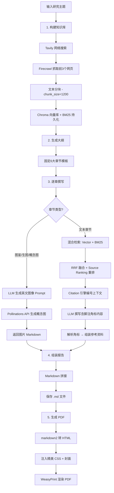

# 🔬 Research Agent

> AI 驱动的行业研究报告自动生成系统 —— 从信息搜集、知识检索到精美排版 PDF，全流程自动化。

[](https://www.python.org/)
[](https://www.langchain.com/)
[](https://www.trychroma.com/)
[](LICENSE)

---

## 📖 项目简介

Research Agent 自动完成行业研究报告的端到端生成：输入一个研究主题，系统自动执行网络搜索、网页内容抓取、本地知识库构建、大纲规划、逐章深度撰写、学术级引用溯源，最终输出专业排版的 Markdown 和印刷级 PDF。

**核心能力：**

- 🔍 **自动信息搜集** — 调用 Tavily 搜索引擎获取最新行业资讯
- 🕷️ **网页内容抓取** — 通过 Firecrawl 将网页转为结构化 Markdown
- 📚 **双引擎知识库** — Chroma 向量检索 + BM25 关键词检索混合召回
- 🧠 **AI 深度撰写** — DeepSeek 大模型基于检索资料撰写专业研报
- 📎 **学术级引用溯源** — 自动编号、角标嵌入、参考资料章节
- 🎯 **信息源分级排序** — 区分权威来源与 UGC 内容，自动加权排序
- 🎨 **多模态概念图** — 自动生成产品概念设计图
- 📄 **印刷级 PDF** — WeasyPrint 渲染，精美封面 + 专业排版

---

## 🏗️ 架构说明

```
research_agent/
├── app/
│   ├── orchestrator/          # 🔑 主工作流编排
│   │   └── workflow.py        #    全流程入口：知识库→大纲→撰写→PDF
│   │
│   ├── planner/               # 📋 规划层
│   │   ├── outline_generator.py  # 大纲生成（固定6大章节）
│   │   ├── query_planner.py      # 查询规划：章节→多检索词拆解
│   │   └── compare_query.py      # 检索策略对比评测
│   │
│   ├── search/                # 🔍 搜索层
│   │   └── tavily_search.py      # Tavily 网络搜索 API
│   │
│   ├── crawler/               # 🕷️ 抓取层
│   │   └── firecrawl_crawler.py  # Firecrawl 网页内容抓取
│   │
│   ├── rag/                   # 📚 检索增强生成（核心）
│   │   ├── chunker.py            # 文本分块（RecursiveCharacterTextSplitter）
│   │   ├── vector_store.py       # Chroma 向量库 + BM25 持久化
│   │   ├── retriever.py          # 混合检索：Vector+BM25+RRF+SourceRanking
│   │   ├── citation_utils.py     # 引用编号与参考资料解析引擎
│   │   └── rag_pipeline.py       # 知识库构建完整管道
│   │
│   ├── context/               # 📝 上下文处理
│   │   └── context_builder.py    # 搜索结果格式化
│   │
│   ├── report/                # 📄 报告生成
│   │   ├── section_writer.py     # 章节撰写（RAG文本 + 多模态绘图分流）
│   │   ├── markdown_formatter.py # Markdown 报告组装
│   │   └── pdf_generator.py      # WeasyPrint 印刷级 PDF（精美CSS封面）
│   │
│   ├── retrieval/             # 📥 简化研究管道
│   │   └── research_pipeline.py  # 搜索+抓取聚合（备用）
│   │
│   └── llm/                   # 🤖 大模型接口
│       ├── client.py             # DeepSeek Chat + Pollinations 图片生成
│       └── client01.py           # 本地 Qwen2.5-7B-Instruct 备用方案
│
├── tests/                     # 🧪 评测脚本
│   ├── eval_retrieval.py         # 纯向量 vs 混合检索对比
│   ├── eval_ranking.py           # Source Ranking 权重算法验证
│   └── eval_citation.py          # 引用溯源引擎单元测试
│
├── outputs/                   # 📦 输出目录
│   ├── v2(citation)_{topic}_report.md
│   ├── v2(citation)_{topic}_report.pdf
│   └── images/{topic}_concept.png
│
├── chroma_db/                 # 向量数据库持久化
├── bm25_db/                   # BM25 语料持久化
├── requirements.txt
└── .env                       # API 密钥配置
```

---

## 🚀 安装方式

### 环境要求

- Python 3.10+
- pip

### 安装步骤

```bash
# 1. 克隆项目
git clone <repo-url>
cd research_agent

# 2. 安装依赖
pip install -r requirements.txt

# 3. 配置 API 密钥（创建 .env 文件）
cat > .env << EOF
DEEPSEEK_API_KEY=sk-your-deepseek-key
TAVILY_API_KEY=tvly-your-tavily-key
FIRECRAWL_API_KEY=fc-your-firecrawl-key
EOF
```

### API 密钥获取

| 服务 | 用途 | 获取地址 |
|------|------|----------|
| DeepSeek | 大模型文本生成 | https://platform.deepseek.com |
| Tavily | 网络搜索 | https://tavily.com |
| Firecrawl | 网页内容抓取 | https://firecrawl.dev |

---

## 📘 使用示例

### 一键运行

```bash
cd research_agent
python app/orchestrator/workflow.py
```

在 [`workflow.py`](app/orchestrator/workflow.py) 底部修改 `topic` 变量即可切换研究主题：

```python
if __name__ == "__main__":
    topic = "AI眼镜行业"          # 修改这里
    run_workflow(topic)
```

### 单独测试各模块

```bash
# 知识库构建
python app/rag/rag_pipeline.py

# 混合检索测试
python app/rag/retriever.py

# 大纲生成测试
python app/planner/outline_generator.py

# 查询规划测试
python app/planner/query_planner.py

# 检索策略评测
python tests/eval_retrieval.py

# Source Ranking 算法评测
python tests/eval_ranking.py

# 引用溯源引擎评测
python tests/eval_citation.py
```

---

## 🔄 工作流说明



### 关键机制详解

#### 混合检索
同时执行两种互补检索策略：
- **向量检索**（Chroma）— 利用 `bge-small-zh-v1.5` 捕捉语义相似度
- **关键词检索**（BM25 + Jieba 分词）— 精确匹配专有名词和技术术语

#### RRF 融合排序
采用 Reciprocal Rank Fusion 算法融合两路结果，同时引入 **Source Ranking** 信息源分级权重：

| 级别 | 权重 | 来源类型 | 示例 |
|------|------|----------|------|
| T0 | ×1.5 | PDF 报告、政府网站、交易所 | `.pdf`, `.gov`, `sse.com.cn` |
| T1 | ×1.2 | 专业商业媒体、深度研报 | `36kr.com`, `caixin.com`, `huxiu.com` |
| T2 | ×1.0 | 普通新闻网站 | 默认 |
| T3 | ×0.5 | UGC 社区、自媒体 | `zhihu.com`, `weibo.com`, `xiaohongshu.com` |

#### 引用溯源
1. **阶段一**：URL 去重编号，同一来源的多个 Chunk 共享一个编号
2. **阶段二**：LLM 在正文中使用 `[^n]` 格式的脚注角标
3. **阶段三**：正则解析所有使用过的编号，自动在文末拼接「参考资料」章节

#### 多模态绘图分流
当章节标题包含「图鉴」「生图」「概念图」关键词时，自动切换为绘图管道：
1. LLM 将研究主题转化为英文工业设计 Prompt
2. 调用 Pollinations API（基于 FLUX 模型）生成概念图
3. 以 Markdown 图片语法嵌入报告

---

## 📊 输出结果示例

运行完成后，在 `outputs/` 目录生成以下文件：

```
outputs/
├── v2(citation)_{topic}_report.md      # Markdown 报告（含引用角标）
├── v2(citation)_{topic}_report.html    # 中间 HTML
├── v2(citation)_{topic}_report.pdf     # 印刷级 PDF（精美封面+排版）
└── images/
    └── {topic}_concept.png             # 产品概念设计图
```

### 报告章节结构

```markdown
# {研究主题}

## 1. 产品设计理念
## 2. 使用场景
## 3. 现有产品分析
## 4. 市场分析
## 5. 人的使用习惯
## 6. 产品概念简易图鉴

---

### 📚 参考资料
[^1]: 来源链接: <https://...>
[^2]: 来源链接: <https://...>
```

---

## 🧪 评测体系

项目内置三套自动化评测脚本：

| 脚本 | 评测目标 | 对比维度 |
|------|----------|----------|
| `eval_retrieval.py` | 检索质量 | 纯向量检索 vs 混合检索（Vector + BM25 + RRF） |
| `eval_ranking.py` | 排序公平性 | 无权重 RRF vs 加权 Source Ranking RRF |
| `eval_citation.py` | 引用准确性 | URL 去重编号、角标解析、参考资料组装 |

运行方式：

```bash
cd research_agent
python tests/eval_retrieval.py    # 输出: tests/retrieval_comparison_result.md
python tests/eval_ranking.py      # 输出: tests/source_ranking_result.md
python tests/eval_citation.py     # 控制台输出
```

---

## 🗺️ 后续规划

- [ ] **动态大纲生成** — 当前为固定6章节模板，支持 LLM 根据主题自动规划章节
- [ ] **多模型适配** — 抽象 LLM Provider 接口，支持 OpenAI / Claude / 本地模型切换
- [ ] **本地搜索增强** — 支持 SearXNG 等自部署搜索引擎，降低 API 依赖
- [ ] **增量知识库更新** — 避免每次运行都重建整个向量库
- [ ] **报告模板自定义** — 支持用户自定义章节结构和排版风格
- [ ] **多轮交互编辑** — 支持用户对生成内容提出修改意见并迭代
- [ ] **PDF 中文排版优化** — 引入更丰富的中文字体支持
- [ ] **更多检索评测指标** — 引入 NDCG、MAP 等标准检索评测指标

---

## 📄 许可证

MIT License
