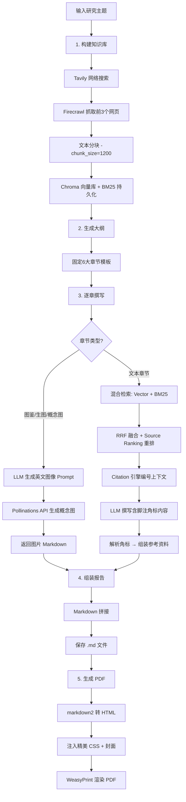
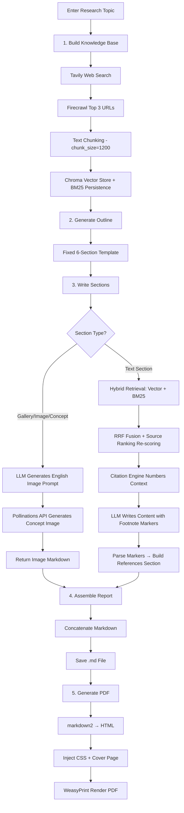

# 🔬 Research Agent

> AI 驱动的行业研究报告自动生成系统 —— 从信息搜集、知识检索到精美排版 PDF，全流程自动化。支持 Web 管理界面与异步任务队列。

[](https://www.python.org/)
[](https://fastapi.tiangolo.com/)
[](https://docs.celeryq.dev/)
[](https://react.dev/)
[](https://vitejs.dev/)
[](https://www.langchain.com/)
[](https://www.trychroma.com/)
[](LICENSE)

---

## 📖 项目简介

Research Agent 自动完成行业研究报告的端到端生成：输入一个研究主题，系统自动执行网络搜索、网页内容抓取、本地知识库构建、大纲规划、逐章深度撰写、学术级引用溯源，最终输出专业排版的 Markdown 和印刷级 PDF。

系统包含三大组件：

- **🧠 研究引擎** (`app/`) — 核心的 RAG 管道与报告生成逻辑
- **⚙️ 后端服务** (`backend/`) — FastAPI REST API + Celery 异步任务队列 + SQLite/PostgreSQL 持久化
- **🎨 前端界面** (`frontend/`) — React + Vite + TypeScript + Tailwind CSS + Shadcn UI 管理面板

### 核心能力

- 🔍 **自动信息搜集** — 调用 Tavily 搜索引擎获取最新行业资讯
- 🕷️ **网页内容抓取** — 通过 Firecrawl 将网页转为结构化 Markdown
- 📚 **双引擎知识库** — Chroma 向量检索 + BM25 关键词检索混合召回
- 🧠 **AI 深度撰写** — DeepSeek 大模型基于检索资料撰写专业研报
- 📎 **学术级引用溯源** — 自动编号、角标嵌入、参考资料章节
- 🎯 **信息源分级排序** — 区分权威来源与 UGC 内容，自动加权排序
- 🎨 **多模态概念图** — 自动生成产品概念设计图
- 📄 **印刷级 PDF** — WeasyPrint 渲染，精美封面 + 专业排版
- 🌐 **Web 管理界面** — 项目创建、进度追踪、在线阅读报告
- ⚡ **异步任务队列** — Celery + Redis 支撑的异步报告生成管道

---

## 🏗️ 完整架构

```
research_agent/
│
├── app/                                    # 🧠 核心研究引擎
│   ├── orchestrator/workflow.py            #    全流程入口
│   ├── planner/                            #    规划层
│   │   ├── outline_generator.py            #      大纲生成
│   │   ├── query_planner.py                #      检索词规划
│   │   └── compare_query.py                #      检索策略对比
│   ├── search/tavily_search.py             #    🔍 Tavily 搜索
│   ├── crawler/firecrawl_crawler.py        #    🕷️ Firecrawl 抓取
│   ├── rag/                                #    📚 检索增强生成
│   │   ├── chunker.py                      #      文本分块
│   │   ├── vector_store.py                 #      Chroma + BM25
│   │   ├── retriever.py                    #      混合检索
│   │   ├── citation_utils.py               #      引用引擎
│   │   └── rag_pipeline.py                 #      知识库管道
│   ├── report/                             #    📄 报告生成
│   │   ├── section_writer.py               #      章节撰写
│   │   ├── markdown_formatter.py           #      Markdown 组装
│   │   └── pdf_generator.py                #      PDF 渲染
│   ├── llm/                                #    🤖 大模型接口
│   │   ├── client.py                       #      DeepSeek + Pollinations
│   │   └── client01.py                     #      本地 Qwen2.5 备用
│   └── context/context_builder.py          #    上下文处理
│
├── backend/                                # ⚙️ FastAPI 后端服务
│   ├── app/
│   │   ├── main.py                         #    FastAPI 入口
│   │   ├── core/
│   │   │   ├── config.py                   #    配置管理 (Pydantic Settings)
│   │   │   ├── database.py                 #    数据库引擎
│   │   │   ├── celery_app.py               #    Celery 应用
│   │   │   └── celery_db.py                #    Celery DB 会话
│   │   ├── api/v1/
│   │   │   ├── router.py                   #    路由注册
│   │   │   └── endpoints/projects.py       #    项目 REST API
│   │   ├── models/                         #    SQLAlchemy ORM
│   │   │   ├── project.py                  #      项目模型
│   │   │   ├── task.py                     #      任务模型
│   │   │   └── document.py                 #      文档模型
│   │   ├── schemas/                        #    Pydantic 数据模型
│   │   └── tasks/                          #    Celery 异步任务
│   │       ├── report_workflow.py          #      工作流编排 (6步)
│   │       ├── search_tasks.py             #      搜索任务
│   │       ├── knowledge_tasks.py          #      知识库任务
│   │       ├── writing_tasks.py            #      撰写任务
│   │       └── render_tasks.py             #      渲染任务
│   ├── outputs/                            #    报告输出目录
│   ├── alembic/                            #    数据库迁移
│   ├── local_dev.db                        #    SQLite 开发数据库
│   ├── Dockerfile
│   └── docker-compose.yml
│
├── frontend/                               # 🎨 React 前端界面
│   ├── src/
│   │   ├── App.tsx                         #    路由配置
│   │   ├── main.tsx                        #    入口
│   │   ├── pages/
│   │   │   ├── DashboardPage.tsx           #    控制台 · 项目创建与列表
│   │   │   ├── ProgressPage.tsx            #    进度追踪 · 6步管道可视化
│   │   │   └── ReportPage.tsx              #    报告阅读器 · 引用溯源气泡
│   │   ├── components/
│   │   │   ├── layout/Layout.tsx           #    全局布局
│   │   │   ├── layout/Sidebar.tsx          #    侧边栏导航
│   │   │   ├── projects/
│   │   │   │   ├── CreateProjectModal.tsx  #    创建项目弹窗
│   │   │   │   ├── ProjectCard.tsx         #    项目卡片
│   │   │   │   └── ProgressTracker.tsx     #    进度跟踪组件
│   │   │   ├── report/CitationMarkdown.tsx #    可交互报告渲染
│   │   │   └── common/                     #    Shadcn UI 组件
│   │   ├── hooks/useProjects.ts            #    React Query hooks
│   │   ├── lib/api.ts                      #    Axios API 客户端
│   │   └── types/api.ts                    #    TypeScript 类型定义
│   ├── index.html
│   ├── vite.config.ts
│   ├── tailwind.config.ts
│   └── package.json
│
├── tests/                                  # 🧪 评测脚本
│   ├── eval_retrieval.py
│   ├── eval_ranking.py
│   └── eval_citation.py
│
├── chroma_db/                              # 向量数据库持久化
├── bm25_db/                                # BM25 语料持久化
├── outputs/                                # CLI 模式输出
├── requirements.txt                        # 核心依赖
└── .env                                    # API 密钥
```

---

## 🚀 安装方式

### 环境要求

- Python 3.10+
- Node.js 18+
- Redis 6+（Celery 任务队列）
- pip / npm

### 安装步骤

```bash
# 1. 克隆项目
git clone <repo-url>
cd research_agent

# 2. 安装 Python 依赖
pip install -r requirements.txt
pip install -r backend/requirements.txt

# 3. 安装前端依赖
cd frontend && npm install && cd ..

# 4. 配置 API 密钥（创建 .env 文件）
cat > .env << 'EOF'
DEEPSEEK_API_KEY=sk-your-deepseek-key
TAVILY_API_KEY=tvly-your-tavily-key
FIRECRAWL_API_KEY=fc-your-firecrawl-key
EOF

# 5. 配置后端环境变量
cat > backend/.env << 'EOF'
DATABASE_URL=sqlite+aiosqlite:///./local_dev.db
OUTPUT_DIR=./outputs
REDIS_HOST=localhost
REDIS_PORT=6379
REDIS_DB=0
DEEPSEEK_API_KEY=sk-your-deepseek-key
TAVILY_API_KEY=tvly-your-tavily-key
FIRECRAWL_API_KEY=fc-your-firecrawl-key
EOF

# 6. 初始化数据库（创建表结构）
cd backend && alembic upgrade head && cd ..
```

### API 密钥获取

| 服务 | 用途 | 获取地址 |
|------|------|----------|
| DeepSeek | 大模型文本生成 | https://platform.deepseek.com |
| Tavily | 网络搜索 | https://tavily.com |
| Firecrawl | 网页内容抓取 | https://firecrawl.dev |

---

## 🎬 启动系统

### 完整启动（推荐）

需要 4 个终端窗口：

```bash
# 终端 1: 启动 Redis（如未运行）
redis-server

# 终端 2: 启动 FastAPI 后端
cd research_agent/backend
uvicorn app.main:app --host 0.0.0.0 --port 8000 --reload

# 终端 3: 启动 Celery Worker
cd research_agent/backend
celery -A app.core.celery_app worker -l info --pool=solo

# 终端 4: 启动前端
cd research_agent/frontend
npm run dev -- --host 0.0.0.0
```

### 本地浏览器访问

由于服务运行在服务器上，需要先建立 **SSH 隧道**（在本地电脑终端执行）：

```bash
ssh -L 5173:localhost:5173 -L 8000:localhost:8000 root@<服务器IP> -p 22
```

| 服务 | 本地地址 |
|------|----------|
| 前端界面 | http://localhost:5173 |
| API 文档 (Swagger) | http://localhost:8000/docs |
| 健康检查 | http://localhost:8000/health |

### 快速命令行测试（无需启动前端）

```bash
cd research_agent
python app/orchestrator/workflow.py
```

在 [`workflow.py`](app/orchestrator/workflow.py) 底部修改 `topic` 变量：

```python
if __name__ == "__main__":
    topic = "AI眼镜行业"          # 修改这里
    run_workflow(topic)
```

---

## 🌐 API 接口文档

| 方法 | 路径 | 说明 |
|------|------|------|
| `POST` | `/api/v1/projects` | 创建新研究项目 |
| `GET` | `/api/v1/projects` | 获取项目列表 |
| `GET` | `/api/v1/projects/{id}/status` | 查询项目进度与任务状态 |
| `GET` | `/api/v1/projects/{id}/download` | 下载生成的报告文件 |
| `GET` | `/health` | 健康检查 |
| `GET` | `/` | 静态页（备用） |

### 创建项目示例

```bash
curl -X POST http://localhost:8000/api/v1/projects \
  -H "Content-Type: application/json" \
  -d '{"topic": "新能源汽车"}'
```

### 查询进度

```bash
curl http://localhost:8000/api/v1/projects/{project_id}/status
```

返回状态含 6 步子任务及进度百分比：

```json
{
  "id": "...",
  "topic": "新能源汽车",
  "status": "processing",
  "progress": {
    "percentage": 50,
    "current_step": 3,
    "total_steps": 6,
    "tasks": {
      "search": "completed",
      "build_kb": "completed",
      "generate_outline": "completed",
      "write_sections": "processing",
      "build_report": "pending",
      "generate_pdf": "pending"
    }
  }
}
```

---

## 🎨 前端页面

### 1. 控制台 (`/`)
- 创建新的研究项目（输入主题）
- 查看已有项目列表（状态、进度、时间）
- 一键进入进度追踪或报告阅读

### 2. 进度追踪 (`/progress/:projectId`)
- 6 步管道实时可视化（搜索 → 知识库 → 大纲 → 撰写 → 组装 → PDF）
- 每步状态标识：⌛ 待处理 / ⏳ 进行中 / ✅ 已完成 / ❌ 失败
- 进度百分比动画
- 完成后自动跳转报告页

### 3. 报告阅读器 (`/report/:projectId`)
- Markdown 报告实时渲染
- **引用溯源气泡**：点击 `[^1]` 角标弹出浮层显示参考资料详情
- 下载按钮（PDF / MD）
- 返回项目列表

---

## 🔄 工作流说明



### 关键机制详解

#### 混合检索
同时执行两种互补检索策略：
- **向量检索**（Chroma）— 利用 `bge-small-zh-v1.5` 捕捉语义相似度
- **关键词检索**（BM25 + Jieba 分词）— 精确匹配专有名词和技术术语

#### RRF 融合排序
采用 Reciprocal Rank Fusion 算法融合两路结果，同时引入 **Source Ranking** 信息源分级权重：

| 级别 | 权重 | 来源类型 | 示例 |
|------|------|----------|------|
| T0 | ×1.5 | PDF 报告、政府网站、交易所 | `.pdf`, `.gov`, `sse.com.cn` |
| T1 | ×1.2 | 专业商业媒体、深度研报 | `36kr.com`, `caixin.com`, `huxiu.com` |
| T2 | ×1.0 | 普通新闻网站 | 默认 |
| T3 | ×0.5 | UGC 社区、自媒体 | `zhihu.com`, `weibo.com`, `xiaohongshu.com` |

#### 引用溯源
1. **阶段一**：URL 去重编号，同一来源的多个 Chunk 共享一个编号
2. **阶段二**：LLM 在正文中使用 `[^n]` 格式的脚注角标
3. **阶段三**：正则解析所有使用过的编号，自动在文末拼接「参考资料」章节

#### 多模态绘图分流
当章节标题包含「图鉴」「生图」「概念图」关键词时，自动切换为绘图管道：
1. LLM 将研究主题转化为英文工业设计 Prompt
2. 调用 Pollinations API（基于 FLUX 模型）生成概念图
3. 以 Markdown 图片语法嵌入报告

---

## 📊 输出结果示例

运行完成后，在 `backend/outputs/` 或 `outputs/` 目录生成以下文件：

```
outputs/
├── {topic}_report_{timestamp}.md      # Markdown 报告（含引用角标）
├── {topic}_report_{timestamp}.pdf     # 印刷级 PDF（精美封面+排版）
└── images/
    └── {topic}_concept.png            # 产品概念设计图
```

### 报告章节结构

```markdown
# {研究主题}

## 1. 产品设计理念
## 2. 使用场景
## 3. 现有产品分析
## 4. 市场分析
## 5. 人的使用习惯
## 6. 产品概念简易图鉴

---

### 📚 参考资料
[^1]: 来源链接: <https://...>
[^2]: 来源链接: <https://...>
```

---

## 🧪 评测体系

项目内置三套自动化评测脚本：

| 脚本 | 评测目标 | 对比维度 |
|------|----------|----------|
| `eval_retrieval.py` | 检索质量 | 纯向量检索 vs 混合检索（Vector + BM25 + RRF） |
| `eval_ranking.py` | 排序公平性 | 无权重 RRF vs 加权 Source Ranking RRF |
| `eval_citation.py` | 引用准确性 | URL 去重编号、角标解析、参考资料组装 |

运行方式：

```bash
cd research_agent
python tests/eval_retrieval.py    # 输出: tests/retrieval_comparison_result.md
python tests/eval_ranking.py      # 输出: tests/source_ranking_result.md
python tests/eval_citation.py     # 控制台输出
```

---

## 🗺️ 后续规划

- [ ] **动态大纲生成** — 当前为固定6章节模板，支持 LLM 根据主题自动规划章节
- [ ] **多模型适配** — 抽象 LLM Provider 接口，支持 OpenAI / Claude / 本地模型切换
- [ ] **本地搜索增强** — 支持 SearXNG 等自部署搜索引擎，降低 API 依赖
- [ ] **增量知识库更新** — 避免每次运行都重建整个向量库
- [ ] **报告模板自定义** — 支持用户自定义章节结构和排版风格
- [ ] **多轮交互编辑** — 支持用户对生成内容提出修改意见并迭代
- [ ] **PDF 中文排版优化** — 引入更丰富的中文字体支持
- [ ] **更多检索评测指标** — 引入 NDCG、MAP 等标准检索评测指标
- [ ] **章节任务状态追踪** — 章节撰写子任务异步化，确保 Celery 任务状态正确更新
- [ ] **BM25 语料持久化路径统一** — 修复 Worker 进程中 BM25 语料加载路径不一致的问题
- [ ] **用户认证系统** — 添加 JWT 认证，支持多用户隔离

---

## 📅 每日工作日志 / Daily Changelog

> 记录每日功能更新与待优化内容（中文 + English）。

### 2026-05-29 / May 29, 2026

#### ✨ 每日功能更新 / Daily Feature Updates

| # | 更新内容 | 文件/模块 | 说明 |
|---|---------|-----------|------|
| 1 | 🧪 **"新能源汽车"主题全流程测试通过** | [`backend/outputs/`](backend/outputs/) | 完整运行 6 步工作流：搜索(2 URLs) → 知识库(44 Chunks) → 大纲(6章节) → 章节撰写(DeepSeek 6章) → Markdown 组装 → PDF 渲染(785KB)。总耗时 140 秒。 |
| 2 | 🐛 **修复 Celery 任务 UUID 格式不匹配问题** | [`search_tasks.py`](backend/app/tasks/search_tasks.py), [`writing_tasks.py`](backend/app/tasks/writing_tasks.py), [`render_tasks.py`](backend/app/tasks/render_tasks.py) | SQLite 将 UUID 存储为 32 字符 hex 字符串（无连字符），但 Celery 传入的 `project_id` 带连字符，导致 SQL 查询失败。修复：在 4 处 SQL 查询中使用 `uuid.UUID(project_id).hex` 去除连字符。 |
| 3 | 🌐 **Vite + React 前端完整实现** | [`frontend/`](frontend/) | 3 个核心页面：Dashboard（项目创建与列表）、Progress Tracker（6步管道可视化）、Report Reader（Markdown 渲染 + 引用溯源气泡）。 |
| 4 | ⚡ **FastAPI + Celery 后端完整实现** | [`backend/`](backend/) | 4 个项目 REST API 端点，5 个 Celery 异步任务模块，SQLAlchemy ORM + Alembic 迁移，Redis 任务队列。 |
| 5 | 🚀 **SSH 隧道访问说明** | — | 由于 AutoDL 服务器仅暴露 SSH 端口 22，需通过 `ssh -L` 隧道将本地 5173/8000 端口映射到服务器才能从本地浏览器访问。 |
| 6 | 🐛 **修复 SQLite `NOW()` 函数不兼容问题** | [`report_workflow.py`](backend/app/tasks/report_workflow.py) | SQLite 不支持 `NOW()` 函数，导致 `_update_section_task_status_sync` 在执行 raw SQL 时抛出 `sqlite3.OperationalError`。修复：将 `NOW()` 替换为 Python `datetime.now(timezone.utc)` 参数绑定。 |
| 7 | 🐛 **修复 `save_document_block` "Multiple rows" 错误** | [`celery_db.py`](backend/app/core/celery_db.py), [`projects.py`](backend/app/api/v1/endpoints/projects.py) | 当 `approve-outline` 因失败重试而被重复调用时，旧占位 DocumentBlock 产生重复 `(section_title, order_index)` 记录。`scalar_one_or_none()` 抛出 `MultipleResultsFound`。修复：[`celery_db.py`](backend/app/core/celery_db.py:238) 改用 `.first()` 静默取首行；[`projects.py`](backend/app/api/v1/endpoints/projects.py:282) 在创建新占位块前先 `DELETE` 旧记录。 |
| 8 | ✅ **"人体工学椅"项目全流程验证通过** | [`backend/outputs/`](backend/outputs/) | 在修复上述 2 个 Bug 后，重置失败项目并重新运行，完整通过 6 步工作流，成功生成 PDF 报告。 |

#### 🎯 每日待优化内容 / Daily Optimization Items

| # | 问题描述 | 影响 | 建议修复方向 |
|---|---------|------|-------------|
| 1 | **BM25 语料加载失败 → 降级为纯向量检索** | 非关键，混合检索退化为纯向量检索，召回精度下降 | 统一 Worker 进程中的 `bm25_db/docs.pkl` 持久化路径 |
| 2 | **章节撰写子任务状态未正确更新** | 6个章节撰写任务在数据库中始终为 `PENDING` | `report_workflow.py` 中应以 `send_task()` 异步投递并更新状态 |
| 3 | **数据库 CHECK 约束使用大写枚举值** | 手动 SQL 更新易失败 | 在应用层统一强制大写转换 |
| 4 | **`build_report_markdown` 中的 `asyncio.run()` 开销** | 每次调用都新建事件循环 | 使用全局事件循环或 `nest_asyncio` |
| 5 | **Firecrawl 百度百科抓取失败** | 国内网站可访问性受限 | 添加备用爬虫机制或使用本地 SearXNG 替代 |
---

### 2026-05-28 / May 28, 2026

#### ✨ 每日功能更新 / Daily Feature Updates

| # | 更新内容 | 文件/模块 | 说明 |
|---|---------|-----------|------|
| 1 | 🐛 **修复 `name 'asyncio' is not defined` 运行时错误** | [`app/core/celery_db.py`](backend/app/core/celery_db.py) | `update_project_status_sync` 调用 `asyncio.run()` 但模块缺少 `import asyncio`，导致 Celery Worker 崩溃。已添加 `import asyncio`。 |
| 2 | ✅ **全流程 6 步工作流端到端验证通过** | [`app/tasks/report_workflow.py`](backend/app/tasks/report_workflow.py) | 以"高端乳制品"为主题，完整运行 6 步工作流，总耗时约 162 秒。 |
| 3 | 🔄 **Celery Worker 进程重启 & 数据库重置** | — | 清除旧 Worker 进程，重启新 Worker，完成全流程。 |
| 4 | 📁 **输出文件验证** | [`backend/outputs/`](backend/outputs/) | 确认 PDF 报告（717KB）及其配套 Markdown、HTML、概念图文件均已正确生成。 |

```bash
# 本次运行输出文件清单
backend/outputs/
├── 高端乳制品_report_20260529_002319.md      # Markdown (11KB)
├── 高端乳制品_report_20260529_002319.html    # HTML 中间文件
├── 高端乳制品_report_20260529_002319.pdf     # 印刷级 PDF (717KB)
└── images/
    └── 高端乳制品_concept.png                 # 产品概念设计图
```

#### 🎯 每日待优化内容 / Daily Optimization Items

| # | 问题描述 | 影响 | 建议修复方向 |
|---|---------|------|-------------|
| 1 | **BM25 语料加载失败 → 降级为纯向量检索** | 非关键，混合检索退化 | 统一持久化路径 |
| 2 | **章节撰写子任务状态未正确更新** | 6个任务均为 PENDING | 改为异步投递 |
| 3 | **数据库 CHECK 约束使用大写枚举值** | 手动更新易失败 | 应用层强制大写 |
| 4 | **`asyncio.run()` 开销** | 高频场景性能损耗 | 全局事件循环 |

---

<!-- ============================================================ -->
<!--  ENGLISH VERSION — Complete Translation                        -->
<!-- ============================================================ -->

# 🔬 Research Agent

> AI-powered industry research report generation system — fully automated from information gathering, knowledge retrieval, to beautifully formatted PDF output. Features a web management dashboard and async task queue.

[](https://www.python.org/)
[](https://fastapi.tiangolo.com/)
[](https://docs.celeryq.dev/)
[](https://react.dev/)
[](https://vitejs.dev/)
[](https://www.langchain.com/)
[](https://www.trychroma.com/)
[](LICENSE)

---

## 📖 Overview

Research Agent automates end-to-end generation of industry research reports: enter a research topic, and the system autonomously performs web search, content crawling, local knowledge base construction, outline planning, in-depth chapter writing, academic-grade citation tracking, and outputs professionally formatted Markdown and print-ready PDF documents.

The system consists of three main components:

- **🧠 Research Engine** (`app/`) — Core RAG pipeline and report generation logic
- **⚙️ Backend Service** (`backend/`) — FastAPI REST API + Celery async task queue + SQLite/PostgreSQL persistence
- **🎨 Frontend UI** (`frontend/`) — React + Vite + TypeScript + Tailwind CSS + Shadcn UI management panel

### Core Capabilities

- 🔍 **Automated Search** — Tavily search engine for latest industry information
- 🕷️ **Web Crawling** — Firecrawl converts web pages to structured Markdown
- 📚 **Dual-Engine Knowledge Base** — Chroma vector retrieval + BM25 keyword retrieval hybrid recall
- 🧠 **AI Deep Writing** — DeepSeek LLM writes professional reports based on retrieved materials
- 📎 **Academic Citation Tracking** — Auto-numbering, footnote markers, references section
- 🎯 **Source Ranking** — Distinguishes authoritative vs UGC sources with weighted scoring
- 🎨 **Multimodal Concept Image** — Automatic product concept design image generation
- 📄 **Print-Grade PDF** — WeasyPrint rendering with elegant cover and professional layout
- 🌐 **Web Management UI** — Project creation, progress tracking, online report reading
- ⚡ **Async Task Queue** — Celery + Redis powered async report generation pipeline

---

## 🏗️ Full Architecture

```
research_agent/
│
├── app/                                    # 🧠 Core Research Engine
│   ├── orchestrator/workflow.py            #    Main pipeline entry
│   ├── planner/                            #    Planning layer
│   │   ├── outline_generator.py            #      Outline generation
│   │   ├── query_planner.py                #      Query planning
│   │   └── compare_query.py                #      Strategy comparison
│   ├── search/tavily_search.py             #    🔍 Tavily search
│   ├── crawler/firecrawl_crawler.py        #    🕷️ Firecrawl crawler
│   ├── rag/                                #    📚 RAG pipeline
│   │   ├── chunker.py                      #      Text chunking
│   │   ├── vector_store.py                 #      Chroma + BM25
│   │   ├── retriever.py                    #      Hybrid retrieval
│   │   ├── citation_utils.py               #      Citation engine
│   │   └── rag_pipeline.py                 #      KB construction
│   ├── report/                             #    📄 Report generation
│   │   ├── section_writer.py               #      Section writing
│   │   ├── markdown_formatter.py           #      Markdown assembly
│   │   └── pdf_generator.py                #      PDF rendering
│   ├── llm/                                #    🤖 LLM interfaces
│   │   ├── client.py                       #      DeepSeek + Pollinations
│   │   └── client01.py                     #      Local Qwen2.5 fallback
│   └── context/context_builder.py          #    Context processing
│
├── backend/                                # ⚙️ FastAPI Backend
│   ├── app/
│   │   ├── main.py                         #    FastAPI entry point
│   │   ├── core/
│   │   │   ├── config.py                   #    Settings (Pydantic)
│   │   │   ├── database.py                 #    DB engine
│   │   │   ├── celery_app.py               #    Celery app
│   │   │   └── celery_db.py                #    Celery DB sessions
│   │   ├── api/v1/
│   │   │   ├── router.py                   #    Route registration
│   │   │   └── endpoints/projects.py       #    Project REST API
│   │   ├── models/                         #    SQLAlchemy ORM
│   │   │   ├── project.py                  #      Project model
│   │   │   ├── task.py                     #      Task model
│   │   │   └── document.py                 #      Document model
│   │   ├── schemas/                        #    Pydantic schemas
│   │   └── tasks/                          #    Celery async tasks
│   │       ├── report_workflow.py          #      Workflow orchestrator (6 steps)
│   │       ├── search_tasks.py             #      Search task
│   │       ├── knowledge_tasks.py          #      Knowledge base task
│   │       ├── writing_tasks.py            #      Writing tasks
│   │       └── render_tasks.py             #      Rendering tasks
│   ├── outputs/                            #    Report output directory
│   ├── alembic/                            #    DB migrations
│   ├── local_dev.db                        #    SQLite dev database
│   ├── Dockerfile
│   └── docker-compose.yml
│
├── frontend/                               # 🎨 React Frontend
│   ├── src/
│   │   ├── App.tsx                         #    Route configuration
│   │   ├── main.tsx                        #    Entry point
│   │   ├── pages/
│   │   │   ├── DashboardPage.tsx           #    Dashboard · project creation & list
│   │   │   ├── ProgressPage.tsx            #    Progress tracker · 6-step pipeline viz
│   │   │   └── ReportPage.tsx              #    Report reader · citation popovers
│   │   ├── components/
│   │   │   ├── layout/Layout.tsx           #    Global layout
│   │   │   ├── layout/Sidebar.tsx          #    Sidebar navigation
│   │   │   ├── projects/
│   │   │   │   ├── CreateProjectModal.tsx  #    Create project dialog
│   │   │   │   ├── ProjectCard.tsx         #    Project card
│   │   │   │   └── ProgressTracker.tsx     #    Progress tracking component
│   │   │   ├── report/CitationMarkdown.tsx #    Interactive report renderer
│   │   │   └── common/                     #    Shadcn UI components
│   │   ├── hooks/useProjects.ts            #    React Query hooks
│   │   ├── lib/api.ts                      #    Axios API client
│   │   └── types/api.ts                    #    TypeScript type definitions
│   ├── index.html
│   ├── vite.config.ts
│   ├── tailwind.config.ts
│   └── package.json
│
├── tests/                                  # 🧪 Evaluation scripts
├── chroma_db/                              # Vector DB persistence
├── bm25_db/                                # BM25 corpus persistence
├── requirements.txt                        # Core dependencies
└── .env                                    # API keys
```

---

## 🚀 Installation

### Requirements

- Python 3.10+
- Node.js 18+
- Redis 6+ (for Celery task queue)
- pip / npm

### Setup Steps

```bash
# 1. Clone the repository
git clone <repo-url>
cd research_agent

# 2. Install Python dependencies
pip install -r requirements.txt
pip install -r backend/requirements.txt

# 3. Install frontend dependencies
cd frontend && npm install && cd ..

# 4. Configure API keys (create .env file)
cat > .env << 'EOF'
DEEPSEEK_API_KEY=sk-your-deepseek-key
TAVILY_API_KEY=tvly-your-tavily-key
FIRECRAWL_API_KEY=fc-your-firecrawl-key
EOF

# 5. Configure backend environment variables
cat > backend/.env << 'EOF'
DATABASE_URL=sqlite+aiosqlite:///./local_dev.db
OUTPUT_DIR=./outputs
REDIS_HOST=localhost
REDIS_PORT=6379
REDIS_DB=0
DEEPSEEK_API_KEY=sk-your-deepseek-key
TAVILY_API_KEY=tvly-your-tavily-key
FIRECRAWL_API_KEY=fc-your-firecrawl-key
EOF

# 6. Initialize database (create tables)
cd backend && alembic upgrade head && cd ..
```

### API Key Reference

| Service | Purpose | URL |
|---------|---------|-----|
| DeepSeek | LLM text generation | https://platform.deepseek.com |
| Tavily | Web search | https://tavily.com |
| Firecrawl | Web scraping | https://firecrawl.dev |

---

## 🎬 Starting the System

### Full Stack Startup (Recommended)

You need 4 terminal windows:

```bash
# Terminal 1: Start Redis (if not running)
redis-server

# Terminal 2: Start FastAPI backend
cd research_agent/backend
uvicorn app.main:app --host 0.0.0.0 --port 8000 --reload

# Terminal 3: Start Celery Worker
cd research_agent/backend
celery -A app.core.celery_app worker -l info --pool=solo

# Terminal 4: Start frontend dev server
cd research_agent/frontend
npm run dev -- --host 0.0.0.0
```

### Local Browser Access

If running on a remote server (e.g., AutoDL), establish an **SSH tunnel** from your local machine:

```bash
ssh -L 5173:localhost:5173 -L 8000:localhost:8000 root@<server-ip> -p 22
```

| Service | Local URL |
|---------|-----------|
| Frontend UI | http://localhost:5173 |
| API Docs (Swagger) | http://localhost:8000/docs |
| Health Check | http://localhost:8000/health |

### Quick CLI Test (No Frontend Required)

```bash
cd research_agent
python app/orchestrator/workflow.py
```

Edit the `topic` variable at the bottom of [`workflow.py`](app/orchestrator/workflow.py):

```python
if __name__ == "__main__":
    topic = "AI Glasses Industry"      # Change this
    run_workflow(topic)
```

---

## 🌐 API Endpoints

| Method | Path | Description |
|--------|------|-------------|
| `POST` | `/api/v1/projects` | Create a new research project |
| `GET` | `/api/v1/projects` | List all projects |
| `GET` | `/api/v1/projects/{id}/status` | Query project progress & task status |
| `GET` | `/api/v1/projects/{id}/download` | Download generated report files |
| `GET` | `/health` | Health check |
| `GET` | `/` | Static fallback page |

### Create Project Example

```bash
curl -X POST http://localhost:8000/api/v1/projects \
  -H "Content-Type: application/json" \
  -d '{"topic": "Electric Vehicles"}'
```

### Query Progress

```bash
curl http://localhost:8000/api/v1/projects/{project_id}/status
```

Returns status with 6 sub-tasks and progress percentage:

```json
{
  "id": "...",
  "topic": "Electric Vehicles",
  "status": "processing",
  "progress": {
    "percentage": 50,
    "current_step": 3,
    "total_steps": 6,
    "tasks": {
      "search": "completed",
      "build_kb": "completed",
      "generate_outline": "completed",
      "write_sections": "processing",
      "build_report": "pending",
      "generate_pdf": "pending"
    }
  }
}
```

---

## 🎨 Frontend Pages

### 1. Dashboard (`/`)
- Create new research projects (enter topic name)
- View existing project list (status, progress, timestamps)
- One-click navigation to progress tracker or report reader

### 2. Progress Tracker (`/progress/:projectId`)
- Real-time 6-step pipeline visualization (Search → KB → Outline → Writing → Assembly → PDF)
- Per-step status: ⌛ Pending / ⏳ Processing / ✅ Completed / ❌ Failed
- Animated progress percentage
- Auto-navigate to report page on completion

### 3. Report Reader (`/report/:projectId`)
- Live Markdown report rendering
- **Citation Popovers**: Click `[^1]` markers to see reference source details in a floating tooltip
- Download buttons (PDF / MD)
- Navigate back to project list

---

## 🔄 Workflow



### Key Mechanisms

#### Hybrid Retrieval
Two complementary retrieval strategies executed in parallel:
- **Vector Search** (Chroma) — uses `bge-small-zh-v1.5` for semantic similarity
- **Keyword Search** (BM25 + Jieba) — exact matching for domain-specific terms

#### RRF Fusion Ranking
Reciprocal Rank Fusion merges both result sets, enhanced with **Source Ranking** weights:

| Level | Weight | Source Type | Examples |
|-------|--------|-------------|----------|
| T0 | ×1.5 | PDF reports, government sites, exchanges | `.pdf`, `.gov`, `sse.com.cn` |
| T1 | ×1.2 | Professional business media, in-depth reports | `36kr.com`, `caixin.com` |
| T2 | ×1.0 | General news sites | Default |
| T3 | ×0.5 | UGC communities, self-media | `zhihu.com`, `weibo.com` |

#### Citation Tracking
1. **Phase 1**: URL deduplication — multiple chunks from same source share one number
2. **Phase 2**: LLM inserts `[^n]` footnote markers in text body
3. **Phase 3**: Regex parses all used markers, auto-appends References section

#### Multimodal Image Branch
When section title contains keywords like "Gallery", "Image", or "Concept", automatically switches to image generation pipeline:
1. LLM transforms research topic into an English industrial design prompt
2. Calls Pollinations API (powered by FLUX model) to generate concept image
3. Embeds as Markdown image syntax in the report

---

## 📊 Output Examples

After a successful run, files are generated in `backend/outputs/` or `outputs/`:

```
outputs/
├── {topic}_report_{timestamp}.md      # Markdown report (with citations)
├── {topic}_report_{timestamp}.pdf     # Print-grade PDF
└── images/
    └── {topic}_concept.png            # Product concept image
```

### Report Section Structure

```markdown
# {Research Topic}

## 1. Product Design Philosophy
## 2. Usage Scenarios
## 3. Existing Product Analysis
## 4. Market Analysis
## 5. User Habits
## 6. Product Concept Gallery

---

### 📚 References
[^1]: Source: <https://...>
[^2]: Source: <https://...>
```

---

## 🧪 Evaluation Suite

Three built-in evaluation scripts:

| Script | Target | Comparison |
|--------|--------|------------|
| `eval_retrieval.py` | Retrieval quality | Vector-only vs Hybrid (Vector + BM25 + RRF) |
| `eval_ranking.py` | Ranking fairness | Unweighted RRF vs Weighted Source Ranking RRF |
| `eval_citation.py` | Citation accuracy | URL dedup, marker parsing, references assembly |

Run:

```bash
cd research_agent
python tests/eval_retrieval.py    # Output: tests/retrieval_comparison_result.md
python tests/eval_ranking.py      # Output: tests/source_ranking_result.md
python tests/eval_citation.py     # Console output
```

---

## 🗺️ Roadmap

- [ ] **Dynamic Outline Generation** — LLM plans sections based on topic instead of fixed 6-section template
- [ ] **Multi-Model Support** — Abstract LLM Provider interface for OpenAI / Claude / local models
- [ ] **Local Search Enhancement** — Support SearXNG self-hosted search engines
- [ ] **Incremental KB Updates** — Avoid rebuilding entire vector store on every run
- [ ] **Custom Report Templates** — User-defined section structure and styling
- [ ] **Interactive Editing** — Iterative refinement based on user feedback
- [ ] **PDF Chinese Typography** — Richer CJK font support
- [ ] **More Retrieval Metrics** — NDCG, MAP evaluation
- [ ] **Section Task Status Tracking** — Async section writing with proper Celery status updates
- [ ] **BM25 Path Unification** — Fix corpus loading path inconsistency in Worker process
- [ ] **User Authentication** — JWT auth for multi-user isolation

---

## 📅 Daily Changelog

### 2026-05-29 — Feature Updates

| # | Update | Module | Details |
|---|--------|--------|---------|
| 1 | 🧪 **"Electric Vehicles" E2E test passed** | [`backend/outputs/`](backend/outputs/) | Full 6-step pipeline: Search (2 URLs) → KB (44 chunks) → Outline (6 sections) → Writing (DeepSeek, 6 chapters) → Assembly → PDF (785KB). Duration: 140s. |
| 2 | 🐛 **Fixed Celery UUID format mismatch** | [`search_tasks.py`](backend/app/tasks/search_tasks.py), [`writing_tasks.py`](backend/app/tasks/writing_tasks.py), [`render_tasks.py`](backend/app/tasks/render_tasks.py) | SQLite stores UUIDs as 32-char hex (no hyphens), but Celery passes hyphenated UUIDs. Fix: use `uuid.UUID(project_id).hex` before SQL queries. |
| 3 | 🌐 **Complete Vite + React frontend** | [`frontend/`](frontend/) | 3 core pages: Dashboard, Progress Tracker, Report Reader with citation popovers. |
| 4 | ⚡ **Complete FastAPI + Celery backend** | [`backend/`](backend/) | 4 REST API endpoints, 5 Celery task modules, SQLAlchemy ORM + Alembic, Redis queue. |
| 5 | 🚀 **SSH tunnel access documented** | — | Since AutoDL only exposes port 22, users must run `ssh -L` to access the web UI locally. |
| 6 | 🐛 **Fixed SQLite `NOW()` incompatibility** | [`report_workflow.py`](backend/app/tasks/report_workflow.py) | SQLite does not support the `NOW()` SQL function, causing `sqlite3.OperationalError` in `_update_section_task_status_sync`. Fix: replaced `NOW()` with Python `datetime.now(timezone.utc)` parameter binding. |
| 7 | 🐛 **Fixed `save_document_block` "Multiple rows" error** | [`celery_db.py`](backend/app/core/celery_db.py), [`projects.py`](backend/app/api/v1/endpoints/projects.py) | When `approve-outline` is called multiple times (e.g., after failure+retry), old placeholder DocumentBlocks create duplicate `(section_title, order_index)` rows. `scalar_one_or_none()` throws `MultipleResultsFound`. Fix: [`celery_db.py:238`](backend/app/core/celery_db.py:238) switched to `.first()`; [`projects.py:282`](backend/app/api/v1/endpoints/projects.py:282) added `DELETE` of old records before inserting new placeholders. |
| 8 | ✅ **"Ergonomic Chair" E2E verification passed** | [`backend/outputs/`](backend/outputs/) | After fixing both bugs above, the previously failed "人体工学椅" project was reset and re-run, successfully completing the full 6-step pipeline and generating the PDF report. |

#### Optimization Items

| # | Issue | Impact | Suggested Fix |
|---|-------|--------|---------------|
| 1 | **BM25 corpus load failure → vector-only fallback** | Non-critical; reduced recall precision | Unify BM25 persistence path across Worker processes |
| 2 | **Section writing subtask status not updated** | All 6 tasks remain `PENDING` | Use `send_task()` with status callbacks |
| 3 | **DB CHECK constraints use uppercase enums** | Manual SQL updates may fail | Enforce uppercase at app layer |
| 4 | **`asyncio.run()` overhead in build_report** | New event loop per call | Global event loop or `nest_asyncio` |
| 5 | **Firecrawl Baidu Baike failure** | CN site accessibility limits | Add fallback crawler or local SearXNG |

### 2026-05-28 — Feature Updates

| # | Update | Module | Details |
|---|--------|--------|---------|
| 1 | 🐛 **Fixed `name 'asyncio' is not defined` error** | [`celery_db.py`](backend/app/core/celery_db.py) | Added missing `import asyncio` |
| 2 | ✅ **E2E 6-step workflow verified** | [`report_workflow.py`](backend/app/tasks/report_workflow.py) | Topic "高端乳制品", ~162s total |
| 3 | 🔄 **Celery Worker restart & DB reset** | — | Clean restart, full pipeline completed |
| 4 | 📁 **Output file verification** | [`backend/outputs/`](backend/outputs/) | PDF (717KB), MD, HTML, concept image confirmed |

---

## 📄 License

MIT License
