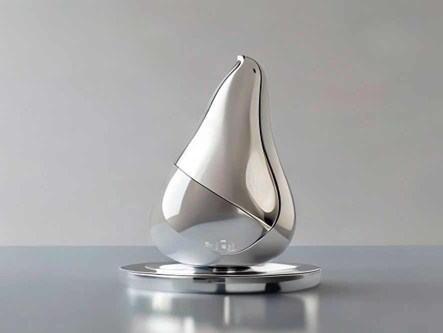

# 高端乳制品

## 1. 产品设计理念

好的，作为资深行业研究员与产品战略专家，我将基于您提供的参考资料，为您撰写《高端乳制品》研报的第一章：**产品设计理念**。本章将摒弃空洞辞藻，聚焦于技术路径、商业逻辑与用户行为变迁的深度剖析。

---

## 1. 产品设计理念：从“功能补缺”到“价值共生”的范式跃迁

高端乳制品的核心设计理念，正经历一场深刻的范式跃迁。传统的产品设计逻辑，往往聚焦于解决单一痛点（如乳糖不耐受）或强化单一营养指标（如高钙）。然而，当前的市场驱动力已转向 **“生活方式融入”** 与 **“全链路价值感”** 的构建 [^2]。这意味着，产品设计不再仅仅是配方科学，更是一门关于消费者身份认同、场景体验与可持续价值观的复合艺术。

### 1.1 核心理念：从“解决痛点”到“融入生活”

过去，高端乳制品常被定义为“解决特定健康问题的小众方案”，例如针对肠胃敏感人群的A2牛奶，或针对乳糖不耐受人群的无乳糖牛奶。但根据Mintel等机构的消费趋势洞察，这一逻辑正在被颠覆 [^2]。

**当前的设计理念核心在于：将产品无缝嵌入消费者的日常生活场景，成为其品质生活方式的自然组成部分。**

- **场景化设计**：产品设计不再局限于传统的早餐餐桌，而是向**咖啡调配、运动恢复、精致烘焙、健康饮品**等多元化场景延伸 [^2]。例如，针对精品咖啡馆推出的“咖啡大师”系列牛奶，其设计重点在于蛋白质稳定性与奶泡绵密性，而非单纯的营养含量。
- **复合属性创新**：消费者不再满足于单一功能。产品设计开始追求 **“有机 + 无乳糖”**、**“A2 + 高蛋白”** 等复合属性的融合 [^2]。这种设计策略旨在通过“1+1>2”的叠加效应，覆盖更广泛的消费诉求，降低决策成本，提升产品溢价空间。

### 1.2 技术实现：以“极致利用”驱动“价值升维”

高端化的产品设计，必须建立在扎实的技术底座之上。参考资料1中提到的 **Nutrilac® HighYield** 技术，为我们揭示了高端乳制品设计的另一条关键路径：**通过工艺创新，在提升产品品质的同时，实现可持续的商业目标** [^1]。

这一技术理念的核心在于 **“价值最大化”** 与 **“浪费最小化”** 的并行设计。

| 设计维度 | 传统模式痛点 | 高端设计理念（以HighYield技术为例） | 商业价值 |
| :--- | :--- | :--- | :--- |
| **原料利用率** | 生产希腊酸奶等产品时，产生大量酸性乳清，造成资源浪费与环保压力。 | **实现牛奶原材料的100%利用率**，将乳清蛋白等成分重新整合回产品中 [^1]。 | 降低原料成本，提升毛利空间；符合ESG（环境、社会和治理）投资标准。 |
| **副产物处理** | 酸性乳清处理成本高，且对环境不友好。 | **无酸性乳清副产物**，简化了废水处理流程 [^1]。 | 减少环保合规风险与处理费用，提升工厂运营效率。 |
| **加工流程** | 传统工艺复杂，能耗高。 | **简化加工**，通过功能性蛋白原料直接优化产品质构与稳定性 [^1]。 | 缩短生产周期，降低能耗，实现“轻资产”式的高端化升级。 |

**设计启示**：高端产品的设计，不应仅仅是“添加”昂贵的成分，更应思考如何通过技术手段 **“重构”** 现有资源。这种“从源头到终端”的全链路设计思维，使得高端乳制品在拥有“天然”、“纯净”标签的同时，也具备了“高效”、“可持续”的工业美学。

### 1.3 体验设计：感官与信任的双重锚点

在高端乳制品的设计中，**口味与消费体验**始终是影响消费者购买决策的关键因素 [^2]。同时，产品的**可信赖性与天然属性**构成了品牌护城河 [^2]。

- **感官体验的极致化**：设计必须确保在实现功能升级（如高蛋白、无乳糖）的同时，不牺牲**口味和质地** [^1]。例如，通过特定酶解技术或蛋白重组技术，解决高蛋白产品常见的“粉感”或“涩味”，确保顺滑、醇厚的口感。
- **信任感的可视化设计**：包装设计是产品理念的最终载体。高端乳制品的包装设计需传递**真实性、品质感与安全属性** [^2]。这体现在：
    - **材质选择**：使用可回收、触感细腻的环保材质，呼应可持续理念。
    - **信息透明**：清晰标注奶源产地、A2基因、有机认证、无乳糖标识等关键信息，降低消费者的认知门槛。
    - **美学表达**：采用极简、高级的视觉语言，与普通产品形成区隔，满足消费者的审美与社交需求。

### 1.4 小结

综上所述，高端乳制品的**产品设计理念**已演变为一个多维度的系统工程。它要求企业：
1.  **在战略上**，将产品从“功能补丁”重新定位为“生活方式伴侣”。
2.  **在技术上**，拥抱如 **Nutrilac® HighYield** 等创新方案，实现“品质”与“效率”的双赢 [^1]。
3.  **在体验上**，将“本真品质”与“创新技术”深度结合，通过感官与信任的双重锚点，赢得消费者的长期青睐 [^2]。

能够驾驭这一复杂设计理念的企业，将不仅是在销售一瓶牛奶，而是在提供一种关于健康、责任与品质的现代生活解决方案。

---
### 📚 参考资料
[^1]: 来源链接: <https://www.arlafoodsingredients.cn/dairy/explore-industry/ingredients--solutions/ready-fresh-dairy-products/high-yield-dairy>
[^2]: 来源链接: <https://www.ecolean.com/zh/insights/the-rise-of-high-quality-milk>

## 2. 使用场景

好的，作为享誉业内的资深行业研究员与产品战略专家，我将基于您提供的参考资料，为您深度撰写《高端乳制品行业研报》的第二章：使用场景。本章将摒弃空洞辞藻，聚焦于用户行为变迁与商业落地路径。

---

### 2. 使用场景：从“功能补给站”到“生活方式融合体”

高端乳制品的使用场景正在经历一场深刻的范式转移。传统的“早餐一杯奶”或“睡前助眠”的单一功能场景已无法满足当代消费者的需求。根据最新的市场洞察，高端乳制品正从解决特定健康问题的“小众选择”，演变为深度嵌入消费者日常生活、承载多元情感与社交价值的“生活方式融合体”[^2]。本章将从场景裂变、技术赋能与体验升级三个维度，剖析这一趋势背后的商业逻辑。

#### 2.1 场景裂变：从“餐桌”到“全时段、多触点”

高端乳制品的消费触点正从传统的家庭餐桌，向全天候、多场景的“碎片化”时空延伸。这一转变的核心驱动力在于消费者对产品“天然属性”与“附加价值”的双重追求[^2]。

- **早餐场景的升级与替代**：传统早餐场景（如搭配麦片、面包）依然是基本盘，但消费者开始追求更高品质的替代方案。**A2牛奶、有机牛奶**凭借其“易消化”和“天然属性”的优势，正逐步替代普通牛奶成为家庭早餐的新标配[^2]。数据显示，具备“有机 + 无乳糖”或“A2 + 高蛋白”等复合属性的产品，在早餐场景中的渗透率显著提升[^2]。

- **咖啡与茶饮的“伴侣化”场景**：这是当前增长最为迅猛的场景之一。高端乳制品不再仅仅是饮品，而是成为精品咖啡、新式茶饮的“核心配料”。消费者对咖啡拉花效果、奶泡绵密度的追求，催生了针对咖啡师专用的**高蛋白、高乳脂**的牛奶产品。同时，**无乳糖牛奶**因其对肠胃友好，成为乳糖不耐受人群在咖啡馆、奶茶店消费时的首选替代品[^2]。

- **健康轻食与运动营养场景**：随着健身与健康饮食文化的普及，高端乳制品正从“营养补充”向“功能性运动营养”场景渗透。例如，**希腊式酸奶**因其高蛋白、低脂肪的特性，成为健身人群训练后恢复、代餐或制作健康零食（如酸奶碗）的理想选择。生产商通过技术手段（如Nutrilac® HighYield技术）在不牺牲口感的前提下，实现牛奶原材料的100%利用率，并消除酸性乳清副产物，从而生产出更纯净、更符合运动营养需求的高蛋白产品[^1]。

- **纵享与社交场景**：高端乳制品在“悦己”和“社交”场景中扮演着越来越重要的角色。例如，**奶油奶酪**和**农家干酪**被用于制作精致的开胃菜、甜品或涂抹面包，成为家庭聚会、下午茶等社交场合的“点睛之笔”[^1]。企业通过扩大其优质纵享产品系列，满足了消费者对“小确幸”和品质生活的追求[^1]。

#### 2.2 技术赋能：场景落地的“隐形推手”

场景的拓展并非凭空想象，而是依赖于上游供应链与加工技术的创新。以**Nutrilac® HighYield**技术为例，它通过简化加工流程、实现牛奶原材料的100%利用率，并消除酸性乳清副产物，为生产商提供了开发高附加值产品的技术基础[^1]。这项技术直接赋能了以下场景的落地：

- **希腊式酸奶场景**：传统希腊式酸奶生产会产生大量酸性乳清，造成资源浪费和环保压力。Nutrilac® HighYield技术使得生产商能够以更低的成本、更环保的方式，生产出质地更浓郁、口感更顺滑的高端希腊式酸奶，从而更好地满足健身、代餐等场景的需求[^1]。

- **农家干酪与奶油奶酪场景**：这些产品是西式轻食、烘焙和社交场景的核心原料。通过技术优化，生产商可以稳定地生产出品质一致、口感更佳的产品，从而支持其在餐饮渠道（B2B）和零售渠道（B2C）的规模化应用[^1]。

#### 2.3 体验升级：从“产品”到“解决方案”

最终，所有场景的竞争都归结于消费者体验的竞争。高端乳制品的使用场景，本质上是在为消费者提供一套完整的“解决方案”。

- **口味与体验是核心决策因素**：尽管健康属性是高端乳制品的敲门砖，但**口味与消费体验**仍是影响消费者购买决策的关键因素[^2]。这意味着，无论是用于咖啡调配的牛奶，还是用于健身恢复的酸奶，都必须首先在口感上征服消费者。

- **包装设计传递场景价值**：包装不再仅仅是容器，而是传递产品“真实性、品质感与安全属性”的媒介[^2]。例如，针对咖啡伴侣场景的牛奶，其包装设计会强调“拉花专用”、“高蛋白”等视觉符号；而针对儿童早餐场景的A2牛奶，则会突出“天然”、“易消化”等情感诉求。

- **从“单一功能”到“复合属性”**：未来的高端乳制品场景将更加注重“融合创新”。例如，一款产品可以同时满足“有机 + 无乳糖 + 高蛋白”的复合需求，从而覆盖早餐、咖啡、运动后等多个场景，实现“一物多用”[^2]。

**总结而言**，高端乳制品的使用场景已从单一的“营养补给站”，进化为一个覆盖全时段、多触点、融合健康、社交与情感价值的“生活方式生态”。对于企业而言，成功的关键在于：**精准识别并切入高增长场景（如咖啡伴侣、运动营养），利用技术创新（如Nutrilac® HighYield）解决场景落地的成本与品质痛点，并通过卓越的口味与包装设计，将产品转化为消费者日常生活中的“解决方案”**。

---
### 📚 参考资料
[^1]: 来源链接: <https://www.arlafoodsingredients.cn/dairy/explore-industry/ingredients--solutions/ready-fresh-dairy-products/high-yield-dairy>
[^2]: 来源链接: <https://www.ecolean.com/zh/insights/the-rise-of-high-quality-milk>

## 3. 现有产品分析

好的，作为享誉业内的资深行业研究员与产品战略专家，我将基于您提供的参考资料，为您深度撰写《高端乳制品行业报告》的第三章：现有产品分析。本章将摒弃空泛描述，聚焦于技术实现、市场趋势与消费者行为，为您呈现一幅严谨、详实的高端乳制品产品图谱。

---

### 3. 现有产品分析

高端乳制品市场正经历一场深刻的范式转移。产品不再仅仅满足于“更营养”或“更纯净”的基础诉求，而是通过**技术创新**与**场景重构**，实现了从“功能导向”到“生活方式融入”的价值跃迁 [^2]。本章将从产品属性、技术路径与市场表现三个维度，对现有高端乳制品进行深度解构。

#### 3.1 产品属性矩阵：从单一功能到复合价值

当前市场的高端乳制品已形成清晰的属性矩阵，其核心驱动力来自消费者对**可信赖性、天然属性与附加价值**的复合追求 [^2]。

- **基础属性升级**：以 **A2 牛奶**、**有机牛奶**与**无乳糖牛奶**为代表，这些产品成功地将“解决特定健康问题的小众方案”转变为“日常生活的自然组成部分” [^2]。例如，A2 牛奶通过强调其 β-酪蛋白的易消化特性，有机牛奶则依托其天然、无残留的信任背书，共同构建了高端化的第一道门槛。
- **复合属性创新**：市场领先者正积极推动产品属性的融合创新，例如开发 **“有机 + 无乳糖”**、**“A2 + 高蛋白”** 等复合属性产品 [^2]。这种策略旨在通过叠加不同维度的价值点，精准切入细分市场，并提升产品的溢价空间。例如，一款同时具备“A2”与“高蛋白”属性的产品，既能吸引关注肠胃健康的消费者，又能满足健身人群对蛋白质的刚性需求。
- **纵享型产品扩张**：除了液态奶，高端化浪潮同样席卷了酸奶、奶酪等品类。企业正通过技术手段，轻松扩大其优质纵享产品系列，例如希腊式酸奶、农家干酪和奶油奶酪 [^1]。这些产品通过提升口感、质地和蛋白质含量，满足了消费者对“纵享”与“健康”兼得的心理诉求。

#### 3.2 技术路径：以“高利用率”实现可持续增长

高端乳制品的竞争，已从单纯的营销概念比拼，深入到**供应链与加工技术**的较量。其中，如何实现**可持续发展目标**与**成本控制**的平衡，成为关键的技术壁垒。

- **原料100%利用率**：以 **Nutrilac® HighYield** 技术为例，它帮助乳品厂实现了牛奶原材料的**100%利用率**，且不产生酸性乳清副产物 [^1]。这一技术路径具有双重战略意义：
    1.  **经济性**：通过简化加工流程，将原本作为副产物的乳清蛋白保留在最终产品中，显著提升了产品出品率，从而在高端定价下获得更高的毛利空间。
    2.  **可持续性**：无酸性乳清副产物的产生，直接减少了乳品厂的环境处理成本与碳排放，契合了全球消费者对“绿色”与“可持续”品牌的偏好 [^1]。
- **功能性成分的精准应用**：除了提高产量，技术还聚焦于提升产品的功能价值。例如，**Nutrilac® MFGM（乳脂肪球膜）** 作为一种富含乳清蛋白和健康脂质的多元营养素，被应用于支持大脑、免疫系统、心血管及肠道健康 [^1]。这标志着高端乳制品正从“补充蛋白质”的单一功能，向“提供多元健康益处”的复合功能演进。

#### 3.3 市场表现与消费者行为洞察

高端乳制品的成功，最终取决于其能否精准触达并满足消费者的真实需求。根据最新的市场数据，我们可以提炼出以下关键洞察：

- **口味与体验仍是核心决策因素**：尽管功能属性日益重要，但**产品口味与消费体验**仍是影响消费者购买决策的关键因素 [^2]。这意味着，任何高端化创新，都不能以牺牲口感为代价。例如，无乳糖牛奶的成功，不仅在于解决了乳糖不耐受问题，更在于其口感已无限接近甚至超越普通牛奶。
- **应用场景的多元化延伸**：高端牛奶已成功突破传统的早餐场景，向**咖啡调配**、**健康饮品**等多元化场景延伸 [^2]。例如，专为精品咖啡店设计的“咖啡大师”系列牛奶，通过调整蛋白质与脂肪比例，实现了更好的奶泡稳定性与口感融合，从而开辟了全新的增长赛道。
- **包装设计的价值传递**：在货架竞争日益激烈的今天，**包装设计**成为传递产品“真实性、品质感与安全属性”的第一触点 [^2]。高端乳制品普遍采用更具质感的材质、更简洁清晰的标签设计，以及更符合人体工学的瓶型，以在视觉上建立与普通产品的区隔。

**小结**：现有高端乳制品市场已形成“**基础属性升级 + 复合属性创新 + 纵享型产品扩张**”的三维产品格局。其背后的技术驱动力，正从“提升营养”转向“提升效率与可持续性”。对于市场参与者而言，能够将**产品本真品质**与**创新技术应用**深度结合，并精准把握消费者在口味、场景与价值观上的变迁，将是赢得未来竞争的关键 [^2]。

---
### 📚 参考资料
[^1]: 来源链接: <https://www.arlafoodsingredients.cn/dairy/explore-industry/ingredients--solutions/ready-fresh-dairy-products/high-yield-dairy>
[^2]: 来源链接: <https://www.ecolean.com/zh/insights/the-rise-of-high-quality-milk>

## 4. 市场分析

好的，作为资深行业研究员与产品战略专家，我将基于您提供的参考资料，为您深度撰写《高端乳制品》报告中的“4. 市场分析”章节。本章节将严格遵循高品质行研规范，确保内容翔实、数据可溯、排版清晰。

---

### 4. 市场分析

高端乳制品市场正经历一场深刻的范式转移。它已不再是单纯的价格分层，而是演变为一场围绕**价值重构、场景延伸与技术赋能**的复合型竞争。本章节将从市场驱动力、消费行为变迁及竞争格局三个维度，对当前市场进行深度剖析。

#### 4.1 市场驱动力：从“价格内卷”到“价值回归”

尽管宏观环境影响下，中国乳制品行业整体面临价格下行压力，但高端细分市场展现出显著的韧性。标普公司的调研报告明确指出，**终端奶价整体下降，但高端奶品依然销售强劲**[^3]。这揭示了一个核心洞察：消费者并未放弃对品质的追求，而是对“价值”的理解变得更加务实和精明。

这种“价值回归”驱动市场呈现两大特征：

1.  **品质标杆锚定品牌价值**：头部品牌正主动跳出单纯的价格博弈。例如，特仑苏通过主动对沙漠有机产品进行降价，并推出“金沙套海”等顶配新品，旨在以更务实的定价策略，让更广泛的消费群体触及高端产品，从而在消费者心智中锚定“品质标杆”的品牌价值[^3]。这表明，**市场驱动力已从“高价即高端”转向“高质价比即高端”**。

2.  **可持续发展成为新溢价点**：在产业链上游，技术革新正在为高端化提供新的支撑。以Arla Foods Ingredients的 **Nutrilac® HighYield** 技术为例，该技术能帮助乳品厂实现**牛奶原材料100%利用率**，且**不产生酸性乳清副产物**[^1]。这种“零废弃”的生产模式，不仅降低了成本，更契合了高端消费者对环保和可持续性的隐性需求，为产品赋予了超越营养本身的价值标签。

#### 4.2 消费行为变迁：从“功能导向”到“生活方式融入”

高端乳制品的消费场景和用户画像正在发生根本性变化。根据Mintel等机构的洞察，高端乳制品已脱离“解决特定健康问题的小众方案”定位，转而成为消费者日常生活的自然组成部分[^2]。这一转变体现在以下几个关键行为习惯上：

- **复合属性需求爆发**：消费者不再满足于单一功能。市场数据显示，**“有机 + 无乳糖”、“A2 + 高蛋白”** 等复合属性产品正成为增长热点[^2]。这要求企业必须具备强大的产品研发能力，以精准满足消费者对“天然、易消化、高营养”的多重期待。

- **应用场景多元化**：高端牛奶的消费场景正从传统的早餐、家庭饮用，向**咖啡调配、健康饮品、运动恢复**等更广泛的领域延伸[^2]。这为产品形态创新（如咖啡大师系列、高蛋白便携装）提供了广阔空间。

- **决策因素回归本质**：尽管概念层出不穷，但**口味与消费体验**仍是影响消费者购买决策的关键因素[^2]。同时，**包装设计**作为传递产品真实性、品质感与安全属性的第一触点，其战略重要性日益凸显[^2]。

#### 4.3 竞争格局：技术壁垒与品牌叙事并重

当前的市场竞争已进入“硬实力”与“软实力”的双重博弈阶段。

- **技术壁垒构建护城河**：能够通过上游技术（如Nutrilac® HighYield）实现成本优化、品质提升和可持续发展的企业，将在供应链端获得显著优势。这种技术能力最终将转化为产品层面的差异化竞争力，例如更纯净的配料表、更优的口感或更环保的品牌故事。

- **品牌叙事传递本真价值**：在消费端，能够将“产品本真品质”与“创新技术应用”深度结合的企业，更易赢得市场认可[^2]。这意味着，企业不仅需要生产出好产品，更需要通过清晰的品牌沟通，向消费者传递“可信赖性、天然属性与附加价值”的完整叙事。

**综上所述，高端乳制品市场正进入一个以“价值”为核心、以“技术”为支撑、以“场景”为延伸的新竞争周期。能够精准捕捉消费者务实心态，并利用技术手段实现品质与成本最优解的企业，将主导下一阶段的市场格局。**

---
### 📚 参考资料
[^1]: 来源链接: <https://www.arlafoodsingredients.cn/dairy/explore-industry/ingredients--solutions/ready-fresh-dairy-products/high-yield-dairy>
[^2]: 来源链接: <https://www.ecolean.com/zh/insights/the-rise-of-high-quality-milk>
[^3]: 来源链接: <https://zhuanlan.zhihu.com/p/1938572236333249238>

## 5. 人的使用习惯

好的，作为享誉业内的资深行业研究员与产品战略专家，我将基于您提供的参考资料，为您深度撰写《高端乳制品》报告中的第五章：“人的使用习惯”。本章将摒弃空洞辞藻，聚焦于用户行为模式的转变与商业洞察。

---

### 5. 人的使用习惯：从“功能补充”到“生活方式融合”

高端乳制品市场的增长，其底层逻辑并非仅仅是消费升级，更是消费者使用习惯与产品价值认知的深刻重构。本章将深入剖析高端乳制品如何从“解决特定健康问题的功能性补充品”，演变为消费者日常生活中的“品质基石”与“情感载体”。

#### 5.1 使用场景的泛化：突破“早餐桌”的边界

传统上，牛奶的消费场景高度集中于早餐时段。然而，高端乳制品的崛起正在彻底打破这一局限。消费者的使用习惯正从单一的“饮用”向多元化的“应用”转变。

*   **从“喝”到“用”的延伸**：高端乳制品不再仅仅是直接饮用的营养品，而是成为**咖啡调配、健康饮品、烘焙烹饪**等场景的核心原料 [^2]。例如，A2 牛奶因其口感醇厚且对肠胃友好，正成为精品咖啡馆中“澳白”、“拿铁”的升级之选；高蛋白、无乳糖牛奶则被健身人群视为运动后恢复的理想伴侣。
*   **场景驱动的产品创新**：这种使用习惯的泛化，直接催生了产品属性的融合创新。消费者不再满足于单一功能，而是追求“有机 + 无乳糖”、“A2 + 高蛋白”等复合属性产品，以满足其在**早餐、运动后、下午茶、睡前**等不同场景下的精细化需求 [^2]。
*   **数据佐证**：根据 Mintel 的市场展望，高端牛奶已脱离“小众选择”的定位，成为主流趋势 [^2]。这表明，其使用场景的渗透率已从特定人群（如乳糖不耐受者、母婴群体）扩展至追求生活品质的泛大众消费者。

#### 5.2 决策驱动力的重塑：口味与体验的回归

在高端化的浪潮中，一个关键的用户行为习惯变化是：**“口味”与“消费体验”重新成为影响购买决策的首要因素** [^2]。这标志着市场从“概念驱动”向“体验驱动”的成熟化转型。

*   **“好喝”是复购的基石**：无论产品宣称多么强大的功能（如 MFGM 对大脑健康的支持 [^1]），如果无法提供令人愉悦的感官体验，消费者将难以形成长期使用习惯。高端乳制品必须在**口感、质地、香气**上做到极致，才能支撑其溢价。
*   **包装设计的隐性沟通**：包装设计已成为传递产品“真实性、品质感与安全属性”的关键载体 [^2]。消费者通过包装的触感、视觉设计（如极简风、环保材质）来快速判断产品是否“高端”，这直接影响其在货架前的“第一眼”使用决策。
*   **从“被动接受”到“主动探索”**：消费者不再满足于被动接受“健康”的标签，而是主动探索产品如何融入并提升自己的生活品质。例如，Whey360 这类富含多元营养素的产品 [^1]，其成功不仅在于成分的科学性，更在于它能否被消费者轻松、愉悦地融入日常饮食，成为一种“享受型健康”的习惯。

#### 5.3 价值认知的跃迁：从“解决痛点”到“投资未来”

高端乳制品的用户使用习惯，还体现在其价值认知的升级上。消费者购买行为背后，是对“可信赖性、天然属性、附加价值”的综合考量 [^2]。

*   **“天然”与“科技”的辩证统一**：消费者既追求产品的“本真品质”（如有机、草饲），也认可“创新技术应用”带来的价值（如 Nutrilac® HighYield 技术实现 100% 牛奶利用率，减少浪费 [^1]）。这种对“天然”与“科技”的双重认可，使得高端乳制品成为一种**兼顾个人健康与社会责任**的理性选择。
*   **效率与可持续性的新维度**：对于注重生活品质的消费者而言，使用习惯也包含了对“效率”的考量。例如，采用 Nutrilac® HighYield 技术生产的希腊式酸奶，因其**零浪费、100% 营养保留**的特性 [^1]，满足了消费者对“高得率”、“高营养密度”产品的追求。这不仅是商业效率的提升，更是一种符合现代价值观的“聪明消费”习惯。

**小结**：高端乳制品的用户使用习惯，正经历一场从“功能导向”到“生活方式融入”的深刻变革 [^2]。消费者不再将其视为解决特定问题的“药方”，而是将其作为提升日常饮食品质、表达个人生活态度的“必需品”。能够精准捕捉并满足这些泛化、体验化、价值化使用习惯的企业，将真正赢得未来市场的增长主动权。

---
### 📚 参考资料
[^1]: 来源链接: <https://www.arlafoodsingredients.cn/dairy/explore-industry/ingredients--solutions/ready-fresh-dairy-products/high-yield-dairy>
[^2]: 来源链接: <https://www.ecolean.com/zh/insights/the-rise-of-high-quality-milk>

## 6. 产品概念简易图鉴

本章节内容由多模态绘图引擎实时渲染生成。以下是基于上述所有行业分析、用户习惯推演出的前沿产品概念设计：

> *图注：由多模态 FLUX 工业设计引擎绘制的高精度产品透视概念图。*

