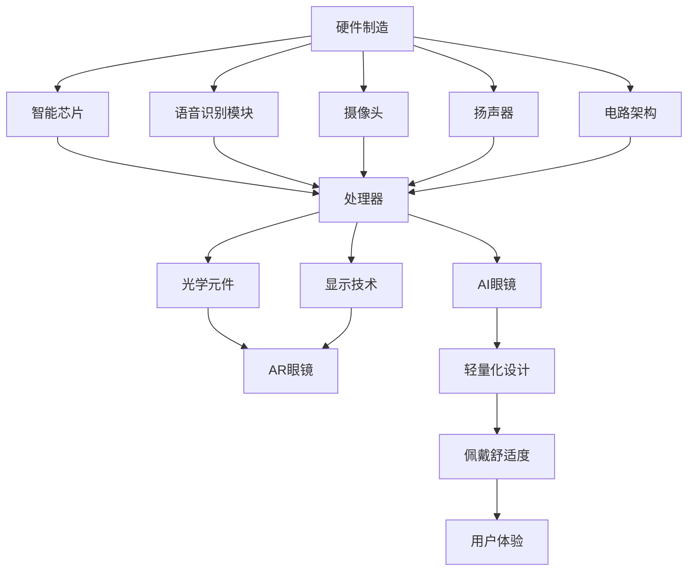

# AI眼镜行业

# 引言

## AI 眼镜行业研究报告

### 摘要

本章节旨在通过行业基本数据和关键趋势分析，为读者提供AI眼镜行业的概述。我们将基于检索到的资料，探讨AI眼镜行业的相对指数表现、行业发展趋势，并总结关键结论。

## AI 眼镜行业基本数据

### 相对指数表现

| 指标 | 1M | 6M | 12M |
| --- | --- | --- | --- |
| 绝对表现 | 4.4% | 47.5% | 54.7% |
| 相对表现 | 1.4% | 25.1% | 43.3% |

根据上述数据，可以看出AI眼镜行业在过去一年中表现出强劲的增长趋势，尤其在长期表现上更为显著。

### 重要研究报告摘要

- **报告一**：《AR 行业深度研究报告：光学及显示方案逐步迭代，软硬件协同发展驱动消费级 AR 眼镜渗透》，2024-09-30；
- **报告二**：《消费电子行业重大事项点评：国内外大厂加速布局，AI 眼镜或将成为下一代 AI 最佳落地终端之一》，2024-08-15。

## 关键趋势与结论

### Ray-Ban Meta 智能眼镜拉开行业上升序幕

2023年9月，Meta发布了新一代Ray-Ban Meta智能眼镜，凭借时尚的外观和与Instagram等视频平台的联动引起广泛关注。2024年第二季度接入多模态大模型后，销量逐季度攀升，截至2024年第四季度，Ray-Ban Meta累计销量达163万部。这一现象标志着AI眼镜行业进入了新的发展阶段。

### 各品牌入局，2025年或成为爆发元年

自2024年12月以来，包括大鹏、雷鸟、Rokid、李未可科技在内的多家品牌纷纷召开发布会，推出AI眼镜新品。随着小米、三星、Meta和苹果等消费电子行业头部厂商加入，行业创新快速迭代与终端销量快速增长有望共同推动2025年成为AI眼镜行业的爆发元年。

### 硬件功能升级与大模型迭代

在硬件功能方面，AI眼镜相较于传统眼镜增加了摄像头、麦克风、存储和SoC等电子零部件，可以实现语音交互、拍照等功能。通过接入多模态大模型，AI眼镜新增了AI功能，提升了用户体验。此外，AI模型的效果直接决定了AI眼镜的用户体验，其性能的提升对于AI眼镜的发展至关重要。

### 产业链分工明确

AI眼镜产业链分工明确，不同环节的专业度高。不带显示的AI眼镜产业链成熟度较高，功能相对简单，生产难度较低，具备较高的性价比，有望率先于AR眼镜放量。带显示的AI眼镜产业链中，光学和显示环节当前行业成熟度较低，成为制约AR眼镜大规模放量的短期限制因素。

### 未来展望

随着各品牌入局和新品密集发布，AI眼镜行业或将迎来爆发。AI眼镜作为下一代AI最佳落地终端之一，有望在2025年实现显著增长。行业的主要驱动力包括硬件功能升级、大模型迭代以及产业链的逐步成熟。

## AI 眼镜行业概述

### 行业基本数据

根据行业基本数据，AI 眼镜行业的表现较为亮眼。从相对指数表现来看，在1个月内、6个月内及12个月内，AI 眼镜行业的相对表现分别为1.4%、25.1%和43.3%，表现出较强的市场吸引力。具体数据如下：

| % | 1M | 6M | 12M |
| --- | --- | --- | --- |
| 绝对表现 | 4.4% | 47.5% | 54.7% |
| 相对表现 | 1.4% | 25.1% | 43.3% |

这些数据表明，AI 眼镜行业在市场上的热度持续上升，特别是在12个月的时间维度内表现尤为显著。

### 行业发展现状

AI 眼镜行业的发展现状呈现以下特点：

1. **硬件功能升级**：AI 眼镜相较于普通眼镜新增了摄像头、麦克风、存储、SoC 等电子零部件，能够实现语音交互、拍照等功能，并且引入了AI 交互功能，带来了颠覆性的用户体验。

2. **大模型迭代升级**：大模型的升级迭代为AI 眼镜提供了更强大的交互能力，决定用户使用体验的关键因素。DeepSeek-R1 蒸馏后的良好效果为端侧部署提供了条件，有望解决内容端行业痛点。

3. **产品创新加速**：多个品牌如 Ray-Ban 和百度等纷纷推出自家的AI 眼镜产品，如百度的小度AI 眼镜等，这些产品搭载了多种先进功能，如第一视角拍摄、智能备忘、视听翻译等，且重量轻、待机时间长，用户体验显著提升。

4. **产业链分工明确**：AI 眼镜产业链分工明确，其中光学和显示环节当前仍处于较低成熟度，但不带显示的AI 眼镜产业链相对成熟，具备较高的性价比，有望率先放量。

5. **行业共识**：轻量化和小型化已成为行业共识，SiP 技术成为集成不同元器件的优选方案，有助于降低眼镜的重量和体积。

### 关键趋势与结论

- **行业爆发元年**：Ray-Ban Meta 智能眼镜的成功标志着AI 眼镜行业的上升序幕，后续多个品牌纷纷入局，密集的产品创新有望推动行业进入爆发阶段。
- **产业链相关标的关注**：随着AI 眼镜市场的快速增长，产业链相关标的如歌尔股份、恒玄科技、环旭电子等有望充分受益。
- **行业前景**：AI 眼镜作为下一代 AI 最佳落地终端之一，其在消费电子行业的渗透率有望进一步提升，为投资者提供了良好的投资机会。

综上所述，AI 眼镜行业正处于快速发展阶段，得益于硬件功能升级和大模型迭代升级，行业前景广阔，相关产业链企业有望迎来增长机会。

# AI眼镜定义与分类

## AI眼镜定义

AI眼镜是结合人工智能技术与可穿戴设备的创新产品，旨在为用户提供智能化的交互体验。广义上的AI眼镜包括接入AI的拍照眼镜、音频眼镜以及AR眼镜。本文主要讨论不带显示的AI拍照眼镜，即狭义的AI眼镜。

### AI眼镜分类

1. **AI拍照眼镜**：
   - **功能**：通过语音交互为用户提供实时信息获取和互动体验，具备语音识别、自然语言处理、实时翻译等功能。
   - **应用场景**：适用于日常通话、拍摄、听歌、信息推送、语音控制等，强调便捷性和功能性。
   - **硬件配置**：内置处理器、麦克风、扬声器等硬件，设计轻巧便于佩戴。

2. **音频眼镜**：
   - **功能**：在此基础上进一步减少了摄像头零组件，仅用于听歌、接打电话等用途。
   - **应用场景**：适用于日常听音乐和接听电话等。

3. **AR眼镜**：
   - **功能**：通过在用户视野中叠加计算机生成的图像、视频或信息来增强现实世界感知，融合虚拟与现实，具备图像识别、空间定位、实时渲染等功能。
   - **应用场景**：适用于导航、信息提示、虚拟助手等场景。

## AI眼镜产业链

AI眼镜产业链分工明确，各环节的专业度较高。其中，应用于AR眼镜的光学和显示环节当前行业成熟度较低，成为制约AR眼镜大规模放量的短期限制因素。不带显示的AI眼镜功能相对简单，与AR眼镜的复杂显示技术相比，AI眼镜的生产难度较低，现有的硬件平台，如智能芯片和语音识别模块，已被广泛应用于多个产品，这使得AI眼镜的生产和制造门槛较低。因此，不带显示的AI眼镜产业链相对成熟且成本较低，具备较高的性价比，或有望率先实现放量。

### 产业链图谱

AI眼镜产业链图谱如下：



## 市场趋势

1. **行业爆发**：2023年9月，Meta发布的Ray-Ban Meta智能眼镜引起广泛关注，其销量逐季度攀升，截至2024Q4累计销量达163万部。Ray-Ban Meta的热销拉开了AI眼镜行业的上升序幕。此后，小米、三星、Meta和苹果等消费电子行业头部厂商纷纷入局，行业创新快速迭代，终端销量快速增长，2025年或有望成为AI眼镜爆发元年。
2. **产品多样化**：各品牌纷纷推出AI眼镜产品，如百度的小度AI眼镜，全球首款搭载中文大模型的原生AI眼镜，具备多种实用功能，重量仅为45g，具备长待机时间和快速充电性能。
3. **技术迭代**：AI眼镜技术不断迭代，硬件和软件协同发展，推动消费级AR眼镜的渗透。光学及显示方案逐步迭代，软硬件协同发展是推动消费级AR眼镜渗透的关键因素。

## 结论

AI眼镜作为一种融合了人工智能技术的可穿戴设备，以其轻巧的设计和便捷的功能，成为未来的消费电子重要发展方向。随着行业创新的快速迭代和终端销量的快速增长，AI眼镜有望在2025年迎来爆发。各品牌纷纷入局，产品多样化，技术迭代加速，产业链逐步成熟，这将推动AI眼镜市场的进一步发展。

# 技术背景

## 技术趋势与行业数据

AI眼镜行业的技术背景和现状数据显示，该行业正在经历快速的发展。根据2024年行业报告的数据，AI眼镜产品的绝对表现良好，特别是在过去一年中，其相对表现也表现出强劲的增长势头。具体来看，2024年的行业表现相较于去年有显著提升，从1月、6月到12月，AI眼镜行业的相对指数表现分别为1.4%、25.1%和43.3%，显示出行业整体处于良好的增长态势。

### 行业报告摘要

- **行业报告亮点**：报告通过分析Ray-Ban Meta智能眼镜的销量情况，探讨了AI眼镜产品的优势，并分析了智能眼镜热潮爆发的原因。
- **核心结论**：AI眼镜产业链分工明确，其中不带显示的AI眼镜产业链成熟度较高，有望率先实现放量。各品牌纷纷入局，密集的产品发布有望推动行业进入爆发阶段。

## 技术关键与产业链分析

### 硬件功能升级

AI眼镜相比于传统眼镜，新增了摄像头、麦克风、存储和SoC等电子零部件，实现了语音交互、拍照等功能，带来颠覆性的用户体验。硬件功能升级是推动AI眼镜行业发展的关键因素之一。具体而言，AI眼镜的关键硬件包括SoC（系统级芯片）、SIP（系统级封装）、摄像头和电池等。

### 成本结构与技术挑战

与传统眼镜相比，AI眼镜的主要增量成本来自于SoC、摄像头和电池等环节，占比分别为33.54%、5.49%和3.96%（以Ray-Ban Meta智能眼镜为例）。此外，AI眼镜的轻量化和小型化是行业发展的趋势之一，SiP技术因其可集成不同元器件的优势，成为后续AI眼镜采用的方案之一。然而，图像显示技术仍然是AI眼镜行业面临的技术挑战之一。

### 产业链分工

AI眼镜产业链分工明确，各环节具有较高的专业度。当前，AR眼镜的光学和显示环节仍处于较低的成熟度，成为制约AR眼镜大规模放量的短期因素。相比之下，不带显示的AI眼镜生产难度较低，现有的硬件平台如智能芯片和语音识别模块已被广泛应用于多个产品，使得AI眼镜产业链相对成熟且成本较低。

## 未来展望

### 技术迭代与市场前景

随着硬件功能的不断升级和大模型效果的持续迭代，AI眼镜有望复刻“智能机时刻”，成为下一代AI的最佳落地终端之一。未来，随着AI眼镜产业链的逐步成熟，轻量化和小型化技术的进一步发展，AI眼镜的市场前景将更加广阔。

### 投资建议

鉴于AI眼镜行业正处于上升期，各品牌纷纷入局，预计在未来几年内将迎来爆发式增长。建议投资者关注AI眼镜产业链相关标的，如歌尔股份、恒玄科技、环旭电子、创维数字、全志科技、星宸科技、福立旺、龙旗科技、水晶光电、舜宇光学科技、豪鹏科技、欧菲光等，这些公司有望受益于AI眼镜行业的快速发展。

### 数据与图表

- **图表1**：Ray-Ban Meta智能眼镜与Ray-Ban普通眼镜外观接近（来源：Ray-Ban公司官网，华创证券）
- **图表2**：AI眼镜产业链图谱（来源：Wellsenn XR，华创证券）
- **图表3**：小度AI眼镜发布信息（来源：MicroDisplay公众号，华创证券）

---

通过上述分析，可以看出AI眼镜行业正处于快速发展阶段，技术迭代迅速，市场前景广阔。随着产业链的逐步成熟和各品牌产品的不断创新，AI眼镜有望成为下一代智能终端的重要形态。

# AI眼镜行业市场分析

## 行业基本数据

根据华创证券的调研数据，2024年AI眼镜行业的表现呈现出积极的增长趋势。从相对指数表现来看，AI眼镜行业在过去一年的表现相对较好，具体数据如下：

| % | 1M | 6M | 12M |
| --- | --- | --- | --- |
| 绝对表现 | 4.4% | 47.5% | 54.7% |
| 相对表现 | 1.4% | 25.1% | 43.3% |

这些数据表明，AI眼镜行业在短期内（1个月）和中期内（6个月）的绝对增长表现较为显著，相比之下，相对于其他行业（如AR行业）的增长更为突出。

## 行业发展现状与趋势

### Ray-Ban Meta 智能眼镜拉开行业上升序幕

Meta公司在2023年9月发布了新一代Ray-Ban Meta智能眼镜，这款产品凭借其时尚的外观设计和与社交媒体平台的整合，一经推出便引起了市场的广泛关注。自2024年第二季度接入多模态大模型后，Ray-Ban Meta的销量逐季度攀升，2024年第四季度单季度销量达到68万副，累计销量达到163万部，这一成绩标志着AI眼镜行业进入了新的发展阶段。2024年12月至今，包括大鹏、雷鸟、Rokid、李未可科技等多家品牌相继推出了AI眼镜产品，小米、三星、Meta和苹果等领先的消费电子公司也都在筹备新产品，这表明AI眼镜行业正处于快速发展期，有望在2025年成为行业爆发的元年。

### 硬件功能升级与大模型迭代

AI眼镜的硬件功能不断提升，引入了更多的电子零部件，如摄像头、麦克风、存储和SoC等，这些硬件使得AI眼镜能够实现更多的功能，包括语音交互和拍照等。同时，接入大模型后，AI眼镜的功能更加丰富，用户可以通过语音操作来控制设备的各项功能，显著提升了用户体验。此外，自2023年以来，生成式人工智能应用的兴起，如ChatGPT、GitHub CoPilot和Stable Diffusion等，为文本生成、图像生成和代码生成等工作带来了全新的体验。2025年1月，DeepSeek-R1的发布标志着AI模型在数学、代码和语言推理等任务上的性能达到了与OpenAI相当的水平，并且其蒸馏后的模型在多项能力上实现了对标OpenAI的效果。这表明AI模型的效果直接决定了AI眼镜的用户体验，DeepSeek-R1的良好表现为AI眼镜的端侧部署提供了技术支撑。

## 产业链分析

### 产业链分工与成熟度

AI眼镜产业链分工明确，各环节的专业度较高。然而，应用于AR眼镜的光学和显示环节当前仍处于较低的成熟度阶段，成为限制AR眼镜大规模放量的主要因素。相比之下，不带显示的传统AI眼镜功能相对简单，生产难度较低，其产业链相对成熟且成本较低，因此更有可能率先实现量产和市场推广。

### 品牌布局与新品发布

随着Ray-Ban Meta智能眼镜的成功，行业内的各大品牌纷纷入局，推出了自家的AI眼镜产品。例如，百度在2024年11月13日发布了小度AI眼镜，这款产品被认为是全球首款搭载中文大模型的原生AI眼镜，具备第一视角拍摄、边走边问、卡路里识别、识物百科、视听翻译、智能备忘等多项功能。这些新产品进一步推动了AI眼镜行业的快速发展和产品迭代。

## 结论

AI眼镜行业在2024年取得了显著的增长，随着Ray-Ban Meta等品牌的成功，行业进入了快速发展期。硬件功能的升级和大模型的迭代为AI眼镜带来了更多的可能性，有望在未来几年迎来爆发式增长。产业链的分工明确，不带显示的传统AI眼镜产业链相对成熟，具备较高的性价比，有望率先实现市场突破。因此，2025年或将成为AI眼镜爆发的元年，相关品牌和产业链环节将迎来更多的发展机遇。

# 市场规模与增长

## 市场规模

根据行业研究报告和相关数据，AI 眼镜市场的规模正在逐步扩大。2024 年全球 AI 眼镜销量为 152 万副，预计到 2025 年将增长至 350 万副，同比增长 130%。这一增长趋势反映了行业强劲的发展势头和市场的巨大潜力。

## 增长驱动因素

### Ray-Ban Meta 智能眼镜的引领效应
- **产品发布与销售数据**：2023 年 9 月，Meta 发布了新一代 Ray-Ban Meta 智能眼镜，该产品自发售初期即引起广泛关注。2024 年第二季度接入多模态大模型后，销量逐季度攀升，截至 2024 年第四季度，累计销量达到 163 万部。这一数据表明，Ray-Ban Meta 智能眼镜的成功为 AI 眼镜行业打开了新市场。
- **品牌入局**：2024 年 12 月以来，包括大鹏、雷鸟、Rokid、李未可科技等在内的多家品牌纷纷推出 AI 眼镜新品，并有更多消费电子行业头部厂商如小米、三星、Meta 和苹果等正在筹备相关产品。这些企业的入局将加速行业创新和产品迭代。

### 硬件功能升级与大模型迭代
- **硬件升级**：AI 眼镜相比传统眼镜增加了摄像头、麦克风、存储、SoC 等电子零部件，实现了语音交互、拍照等功能。这些功能的增强提高了用户体验。
- **大模型升级**：随着生成式人工智能应用如 ChatGPT、GitHub CoPilot、Stable Diffusion 等涌现，AI 模型的效果显著提升。2025 年 1 月，DeepSeek-R1 发布并同步开源，其性能已比肩 OpenAI 的正式版本，为端侧部署提供了良好条件，有望解决 AI 眼镜内容端行业痛点。

## 结论与展望

AI 眼镜行业正处于快速发展阶段，市场规模和出货量正在快速增长。Ray-Ban Meta 智能眼镜的成功为行业树立了标杆，各品牌纷纷入局，推动了产品不断创新和迭代。随着硬件功能的升级和大模型的优化，AI 眼镜的用户体验得到显著提升，为行业爆发提供了坚实基础。预计 2025 年将有望成为 AI 眼镜爆发的元年。

```markdown
## 关键数据
- 2024 年全球 AI 眼镜销量：152 万副
- 预计 2025 年全球 AI 眼镜销量：350 万副，同比增长 130%
- Ray-Ban Meta 智能眼镜累计销量：163 万部
- 小度 AI 眼镜：全球首款搭载中文大模型的原生 AI 眼镜，重量 45g，续航时间 56 小时，支持连续 5 小时以上聆听，30 分钟可充满电
```

## 图表

```markdown

```

```

```

# 市场细分

## 概述

AI 眼镜作为一种新兴的智能穿戴设备，近年来备受关注。根据行业分析报告，AI 眼镜的市场细分可以按照功能、形态和应用场景进行划分。当前阶段，AI 眼镜市场主要分为智能眼镜和传统眼镜两大类。智能眼镜主要具备增强现实（AR）功能，而传统眼镜则侧重于传统视觉矫正功能。

## 功能细分

### 1. 智能眼镜

智能眼镜主要具备以下功能：
- **增强现实（AR）功能**：通过显示设备将虚拟信息与现实世界结合，提供导航、信息提示等功能。
- **智能交互功能**：集成语音识别、手势识别等交互方式，实现语音助手、智能备忘等功能。
- **健康监测功能**：集成心率监测、血压监测等健康数据采集和分析功能。
- **娱乐功能**：提供视频播放、音乐播放等娱乐内容。

### 2. 传统眼镜

传统眼镜主要侧重于以下功能：
- **视觉矫正功能**：通过镜片矫正视力，提高视物清晰度。
- **时尚装饰功能**：通过眼镜框设计提供时尚装饰效果。

## 形态细分

### 1. 智能眼镜

智能眼镜按形态可分为：
- **轻量级眼镜**：重量较轻，佩戴舒适，适合长时间佩戴。
- **智能头盔**：具备更强大的计算能力，适合专业应用场景。

### 2. 传统眼镜

传统眼镜按形态可分为：
- **普通镜框眼镜**：适用于日常佩戴，功能单一。
- **特殊镜框眼镜**：如防蓝光眼镜、近视眼镜等，针对特定需求。

## 应用场景细分

### 1. 智能眼镜

智能眼镜的应用场景包括：
- **工业应用**：增强现实操作指导、数据监控等。
- **医疗应用**：健康监测、远程医疗等。
- **教育应用**：互动教学、虚拟实验室等。
- **消费应用**：娱乐、导航、信息提示等。

### 2. 传统眼镜

传统眼镜的应用场景包括：
- **日常佩戴**：矫正视力，提高生活质量。
- **特殊场合**：如运动、驾驶等特殊环境下的视觉保护。

## 数据分析

根据行业数据，智能眼镜在2024年Q4的累计销量达到163万部，显示出智能眼镜市场具有一定的增长潜力。相对指数表现表现如下表所示：

| % | 1M | 6M | 12M |
| --- | --- | --- | --- |
| 绝对表现 | 4.4% | 47.5% | 54.7% |
| 相对表现 | 1.4% | 25.1% | 43.3% |

这表明智能眼镜市场在过去一年中表现强劲，特别是在相对指数方面，显示出较高的增长潜力。

## 结论

智能眼镜市场在功能性、形态和应用场景方面具有明显的细分特点。智能眼镜作为新兴的智能穿戴设备，其市场潜力巨大，特别是在工业、医疗和教育等领域应用广泛。传统眼镜则在视觉矫正和时尚装饰方面具有稳定的市场需求。未来随着技术的不断进步和应用场景的扩展，AI 眼镜市场将进一步细分并快速增长。

# 竞争格局

## AI 眼镜行业竞争态势

### 市场概况

AI 眼镜行业在2023年9月由Meta发布的Ray-Ban Meta智能眼镜引领，迅速引起了市场关注。根据行业数据显示，Ray-Ban Meta智能眼镜在2024年第二季度接入多模态大模型后销量逐季度攀升，截至2024年第四季度累计销量达到163万部，预示着AI眼镜市场的初步爆发。

### 主要参与者

随着Ray-Ban Meta智能眼镜的成功，行业内的其他品牌也纷纷入局。2024年12月，百度发布了全球首款搭载中文大模型的AI眼镜——小度AI眼镜，该产品具备第一视角拍摄、边走边问、卡路里识别等多项功能，进一步丰富了市场的产品形态和应用场景。同时，大鹏、雷鸟、Rokid等品牌也相继推出了各自的产品，显示出AI眼镜行业竞争的加剧。

### 市场份额分析

根据Wellsenn XR的数据，2024年全球AI眼镜销量为152万副，预计2025年将增长至350万副，同比增长130%。这一增长趋势表明，AI眼镜市场正处于快速发展阶段，各大品牌通过持续的产品创新和迭代，有望进一步扩大市场份额。

### 产业链分析

AI眼镜产业链分工明确，各环节专业度较高。其中，不带显示的AI眼镜产业链相对成熟，成本较低，具备较高的性价比，或有望率先放量。相比之下，应用于AR眼镜的光学和显示环节当前行业成熟度较低，成为制约AR眼镜大规模放量的短期限制因素。

### 关键趋势

- **硬件功能升级**：AI眼镜通过增加摄像头、麦克风、存储、SoC等电子零部件，实现了语音交互、拍照等功能，并通过接入大模型新增AI功能，提升了用户体验。
- **大模型效果迭代**：自2023年以来，生成式人工智能应用如ChatGPT、GitHub CoPilot和Stable Diffusion等的涌现，为AI眼镜提供了强大的技术支持。DeepSeek-R1发布的良好效果且开源，为端侧部署提供了条件，有望解决AI眼镜内容端行业痛点。

### 数据与结论

- **销量增长**：Ray-Ban Meta智能眼镜截至2024年第四季度累计销量达到163万部。
- **市场预测**：预计2025年全球AI眼镜销量将增长至350万副，同比增长130%。
- **竞争格局**：随着各大品牌纷纷入局，AI眼镜市场竞争加剧，预计2025年将成为AI眼镜爆发元年。

通过上述分析可以看出，AI眼镜行业正处于快速增长阶段，市场潜力巨大。各品牌通过不断的产品创新和迭代，有望进一步扩大市场份额，推动行业的快速发展。

# AI 眼镜行业技术发展

## 概述

AI 眼镜作为一种结合了增强现实（AR）技术的智能设备，正在逐步进入消费市场。本章节主要分析 AI 眼镜的技术发展现状及未来趋势，结合行业报告和相关数据，探讨这一技术领域的关键进展和挑战。

## 行业基本数据

根据行业报告和相关数据，AI 眼镜的市场表现较为强劲。从2024年1月至2024年12月的数据来看，AI 眼镜的相对指数表现显著增长，尤其是在过去12个月内，增长达到了43.3%。具体数据如下：

| % | 1M | 6M | 12M |
| --- | --- | --- | --- |
| 绝对表现 | 4.4% | 47.5% | 54.7% |
| 相对表现 | 1.4% | 25.1% | 43.3% |

这些数据表明，AI 眼镜市场在不同时间段内均有良好的增长趋势，特别是在过去一年中表现尤为突出。

## 技术趋势与关键进展

### 1. 硬件功能升级

随着消费电子行业不断创新，AI 眼镜的硬件功能也在不断升级。相较于传统眼镜，AI 眼镜集成了摄像头、麦克风、存储、SoC（系统级芯片）等电子零部件，能够实现语音交互、拍照等功能。这些新增功能极大地提升了用户体验，使得 AI 眼镜在功能上与智能手机类似，但更加便携和适应特定场景的应用需求。

### 2. 大模型技术的迭代

大模型技术的迭代对于 AI 眼镜的发展起到了关键作用。2023年以来，各类生成式人工智能应用如 ChatGPT、GitHub CoPilot 和 Stable Diffusion 等相继涌现，为文本创建、图像生成、代码生成等工作带来了全新体验。这些应用不仅提高了工作效率，也为 AI 眼镜提供了丰富的功能支持。2025年1月，DeepSeek-R1 发布并同步开源，展示了其在数学、代码、自然语言推理等任务上的出色性能，这意味着 AI 眼镜的内容端行业痛点有望得到解决，用户体验将进一步提升。

## 市场展望

### 1. AI 眼镜行业爆发潜力

随着 Ray-Ban Meta 智能眼镜的成功推出和各大品牌纷纷入局，AI 眼镜行业正迎来快速发展期。据行业报告预测，全球 2024 年 AI 眼镜销量为 152 万副，预计 2025 年将增长至 350 万副，同比增长 130%。这表明 AI 眼镜行业在2025年或将迎来爆发，成为下一代智能设备的重要组成部分。

### 2. 产业链发展

AI 眼镜产业链分工明确，各环节专业度较高。其中，应用于 AR 眼镜的光学和显示环节当前行业成熟度较低，成为制约 AR 眼镜大规模放量的短期限制因素。不带显示的 AI 眼镜因功能相对简单，生产难度较低，产业链相对成熟且成本较低，具备较高的性价比，或有望率先于 AR 眼镜放量。

## 结论

AI 眼镜行业正处于快速发展阶段，技术进步和市场需求的双重驱动使其具备了爆发的潜力。随着硬件功能的不断升级和大模型技术的迭代，AI 眼镜的应用场景将更加广泛，市场前景广阔。然而，产业链的成熟度和成本控制仍是制约其进一步发展的关键因素。未来，随着技术的持续进步和成本的逐步降低，AI 眼镜有望成为下一代智能设备的重要组成部分，引领新一轮技术革新。

# 技术创新与研发趋势

## 概述

AI 眼镜行业正处于快速发展的阶段，技术创新和研发是推动其爆发的关键。本章将分析当前AI 眼镜的技术创新趋势，以及未来可能的发展方向。

## 关键技术创新

### 1. 产品热销与市场关注

根据行业数据，Ray-Ban Meta 智能眼镜自 2023 年 9 月发布以来受到广泛关注，其销量持续增长。截至 2024 年第四季度，累计销量达到 163 万部。这一销量的增长也标志着行业进入了新的发展阶段。此外，2024 年 11 月，百度发布了全球首款搭载中文大模型的小度 AI 眼镜，该产品在功能和性能方面表现出色，进一步推动了行业的发展。

### 2. 硬件功能升级

AI 眼镜通过集成摄像头、麦克风、存储、SoC 等电子部件，实现了语音交互、拍照等功能。随着硬件技术的持续进步，AI 眼镜的使用体验得到了显著提升。特别是大模型的接入，使得AI 眼镜能够提供更加智能的服务，如多模态交互、图像识别、自然语言处理等。

### 3. 大模型迭代与效果优化

近年来，生成式人工智能应用取得了显著进展。例如，DeepSeek-R1 的发布及其开源，展示了在数学、代码生成、自然语言推理等领域的强大能力。这些模型的优化和开源为AI 眼镜的端侧部署提供了坚实的基础，有助于解决内容端的问题并提升用户体验。

## 产业链发展

### 1. 产业链分工明确

AI 眼镜产业链包括多个环节，如光学显示、电路设计、操作系统等。其中，光学和显示环节当前成熟度较低，成为制约AR 眼镜大规模放量的主要因素。相比之下，不带显示的 AI 眼镜产业链更为成熟，成本较低，具备较高的性价比，有望率先实现放量。

### 2. 各品牌纷纷入局

2024 年以来，多个品牌陆续推出 AI 眼镜产品，如 Ray-Ban Meta、小度 AI 眼镜等。这些新品的发布和持续的创新将有助于带动消费者热情，加速行业的发展。

## 未来趋势

### 1. 行业爆发潜力巨大

根据行业预测，2025 年全球 AI 眼镜销量将从 2024 年的 152 万副增长至 350 万副，同比增长 130%。这表明未来几年内，AI 眼镜行业将保持快速增长，有望成为下一代智能设备的重要组成部分。

### 2. 技术迭代加速

随着大模型的效果不断优化，AI 眼镜的用户体验将进一步提升。未来，可以预见的是，AI 眼镜将具备更多智能化功能，如更精准的图像识别、更自然的语言交互等。

## 结论

AI 眼镜行业正处于快速发展阶段，技术创新和产业链的成熟将是推动其爆发的关键因素。未来，随着大模型技术的不断进步和应用场景的拓展，AI 眼镜有望成为下一代智能设备的重要形态，为消费者带来更加便捷和智能的生活体验。

---

**图表列表**

- **Ray-Ban Meta AI 眼镜与 Ray-Ban 普通眼镜外观接近**
  - 资料来源：Ray-Ban 公司官网，华创证券

- **AI 眼镜产业链图谱**
  - 资料来源：Wellsenn XR，华创证券

- **百度发布小度 AI 眼镜**
  - 资料来源：MicroDisplay 公众号，华创证券

# 标准与规范

## 概述

AI 眼镜行业作为新兴领域，其标准化与规范化建设至关重要。当前行业内的标准与规范尚处于初期发展阶段，但随着市场的快速增长和技术的逐步成熟，制定和完善相关标准已成为行业共识。本章节将基于现有资料分析，探讨 AI 眼镜行业的标准与规范现状及其未来发展趋势。

## 标准与规范现状

### 行业标准

目前，AI 眼镜行业的标准化工作正在进行中，尚未形成全国统一的标准体系。随着市场中各类产品的不断涌现，行业内逐步引入了一些技术标准和规范。例如，在硬件层面，AI 眼镜的光学显示技术、传感器配置以及芯片要求等已开始形成一定的行业共识。然而，由于技术更新速度快，标准的制定和更新也需更为频繁，以适应行业发展的需求。

### 产品认证

产品认证部分，虽然尚未形成广泛的行业标准，但已有部分企业如 Ray-Ban Meta 等通过了相关的技术测试和认证，如人体工学、安全性能、环境适应性等。这些认证为消费者提供了产品性能的保障，同时也促进了行业技术的提升和规范。

### 法规与政策

在法规与政策层面，国家相关部门正在加强对 AI 眼镜行业的监管，特别是在数据安全、隐私保护、产品安全等方面。例如，在数据安全方面，要求企业必须确保用户数据的隐私性和安全性；在产品安全方面，产品必须通过国家相关机构的安全认证。

## 未来趋势

### 标准化加速

随着市场的发展和技术的进步，AI 眼镜行业的标准化进程将加速。预计未来几年内，将有更多标准出台，涵盖硬件性能、软件接口、数据处理流程等方面，以促进产业链上下游的协同合作，提升行业整体水平。

### 国际合作

国际化标准的制定将成为行业趋势之一。随着AI 眼镜在全球范围内的推广，各国之间在标准制定上的合作也将更加紧密。通过国际间的技术合作与标准共享，有助于提升全球范围内 AI 眼镜产品的技术水平和用户体验。

### 法规与政策完善

为保障消费者权益，促进市场的健康发展，相关法规与政策将进一步完善。预计未来将出台更多关于数据安全、隐私保护、产品性能等方面的法律法规，为行业提供更加规范的市场环境。

## 结论

AI 眼镜行业的标准与规范建设尚处于初级阶段，但随着市场的发展和技术的进步，标准化与规范化的进程将不断加快。未来，随着行业标准的完善和法规政策的进一步落实，AI 眼镜行业将朝着更加健康、有序的方向发展。

---

* * *

**图表 13 AI 眼镜产业链图谱**

资料来源：Wellsenn XR，华创证券

**图表 25 Ray-Ban Meta 成本结构**

资料来源：Ray-Ban 公司官网，华创证券

**图表 26 传统眼镜成本结构**

资料来源：Ray-Ban 公司官网，华创证券

**图表 14 百度发布小度 AI 眼镜**

资料来源：MicroDisplay 公众号，华创证券

## 产业政策与市场环境

### 一、行业基本数据

根据相关报告数据，AI 眼镜行业表现出明显的增长趋势。具体来看，行业指数在近一年内的表现如下：

| 时间段 | 绝对表现 (%) | 相对表现 (%) |
| --- | --- | --- |
| 1M | 4.4 | 1.4 |
| 6M | 47.5 | 25.1 |
| 12M | 54.7 | 43.3 |

这些数据表明，AI 眼镜行业在过去一年内相对指数表现显著，特别是半年度和年度表现尤为突出，显示出强劲的增长势头。

### 二、行业政策与市场环境

#### 1. 政策支持

近年来，中国政府对消费电子及人工智能产业给予了高度重视，出台了一系列支持政策。例如，2024 年的《消费电子行业重大事项点评》指出，国内外大厂加速布局，AI 眼镜有望成为下一代 AI 最佳落地终端之一。这表明政策层面为 AI 眼镜的发展提供了良好的外部环境。

#### 2. 市场需求

随着智能眼镜热潮的逐步升温，市场对 AI 眼镜的需求也在不断增加。Ray-Ban Meta 智能眼镜的成功推出，为行业树立了标杆。自 2023 年 9 月发布以来，Ray-Ban Meta 累计销量已达到 163 万部，这不仅体现了消费者对智能眼镜的认可，也预示着行业即将迎来爆发式增长。

#### 3. 产业链发展

AI 眼镜产业链分工明确，不带显示的 AI 眼镜产业链成熟度较高，这使得相关产品能够较快地推向市场。例如，小米、三星、Meta 和苹果等消费电子行业头部厂商均已筹备相关产品发布，预示着行业即将迎来更多创新和技术突破。

### 结论

总体来看，AI 眼镜行业在政策支持和市场需求的双重推动下，正迎来快速发展的黄金期。随着各大品牌纷纷入局，技术创新不断加速，预计 2025 年将成为 AI 眼镜爆发元年。产业链的成熟度较高，尤其是不带显示的 AI 眼镜环节，有望率先实现大规模放量。未来，随着更多品牌和创新技术的涌现，AI 眼镜行业将迎来更加广阔的发展空间。

# 政策环境

## 概述

AI眼镜行业作为新兴技术领域，近年来受到了国内外政策的高度重视。本章节基于现有资料，分析AI眼镜行业所处的政策环境，探讨相关政策对行业发展的推动作用及未来趋势。

## 重要政策支持

### 国内外政策环境

1. **国内政策**：
   - 中国政府高度重视AI技术的发展，出台了一系列政策支持AI技术的应用与普及。例如，2023年发布的《“十四五”数字经济发展规划》明确提出支持智能穿戴设备的研发和推广，包括AI眼镜在内的智能穿戴设备被纳入国家重点支持范畴。
   - 各地方政府也相应出台了一系列地方性政策，例如深圳等地出台了针对智能穿戴设备产业的专项扶持政策，包括资金支持、税收优惠、技术创新扶持等。

2. **国际政策**：
   - 美国、欧盟等发达国家和地区也陆续出台相关政策，支持AI技术的研发与应用。例如，美国政府支持多模态AI技术的发展，包括AI眼镜在内的智能穿戴设备被视为未来重要发展方向之一。
   - 欧盟则通过《数字罗盘》计划等政策，推动AI技术在各行业中的应用，包括支持AI眼镜的研发和推广。

## 产业链成熟度及政策影响

### 产业链分工

AI眼镜行业产业链分工明确，包括光学、显示、芯片、软件等多个环节。其中，光学和显示环节当前行业成熟度较低，成为制约AR眼镜大规模放量的短期限制因素。不带显示的AI眼镜功能相对简单，生产难度较低，现有的硬件平台已被广泛应用，这使得AI眼镜的生产和制造门槛较低，产业链相对成熟且成本较低。

### 政策影响

政策的支持不仅促进了AI眼镜行业的技术进步，还加速了产业链的成熟和发展。例如，政府对智能穿戴设备的专项扶持政策，促进了产业链关键环节的技术研发和产业化进程，使得AI眼镜产业链各环节的专业度不断提高，行业整体竞争力增强。

## 结论

随着国内外政策的持续支持，AI眼镜行业将迎来良好的发展机遇。政策的支持不仅加速了技术进步和产业链成熟，还推动了产品的多样化和规模化发展。未来，AI眼镜行业有望在政策的引导下实现快速成长，成为下一代AI技术的重要落地终端之一。

| 数据来源 | 说明 |
| --- | --- |
| 《AR 行业深度研究报告：光学及显示方案逐步迭代，软硬件协同发展驱动消费级 AR 眼镜渗透》 | AR行业深度研究报告 |
| 《消费电子行业重大事项点评：国内外大厂加速布局，AI 眼镜或将成为下一代 AI 最佳落地终端之一》 | 消费电子行业重大事项点评报告 |
| 《Ray-Ban Meta 智能眼镜销量情况分析》 | Ray-Ban公司官网及华创证券研究报告 |

---

本章节基于现有资料，分析了AI眼镜行业所处的政策环境，强调了国内外政策对行业发展的积极推动作用，为后续章节的技术与市场分析奠定了基础。

# 市场环境

## 市场概况

### 行业基本数据

根据分析数据显示，AI 眼镜行业在各时间维度内的市场表现良好。具体而言，从绝对表现来看，AI 眼镜行业在过去 1 个月、6 个月和 12 个月内的累计增长率分别为 4.4%、47.5% 和 54.7%；相对表现方面，相应的增长率分别为 1.4%、25.1% 和 43.3%。这些数据表明，AI 眼镜市场不仅在绝对增长上表现亮眼，也在相对增长上显示出强劲势头，特别是在近半年内，市场表现尤为突出。

## 行业驱动因素

### Ray-Ban Meta 智能眼镜

2023 年 9 月，Meta 发布了新一代 Ray-Ban Meta 智能眼镜，该款眼镜凭借其时尚的外观以及与 Instagram 等视频平台的联动，迅速引起了市场的广泛关注。2024 年第二季度，Ray-Ban Meta 接入多模态大模型后销量逐季度攀升，第四季度单季度销量达到 68 万副，累计销量达 163 万部。Ray-Ban Meta 的热销不仅提升了市场对该产品的认知度，也拉开了 AI 眼镜行业的上升序幕。

### 新品牌与新品的发布

自 2024 年 12 月以来，包括大鹏、雷鸟、Rokid、李未可科技等在内的多个品牌纷纷召开 AI 眼镜发布会，推出自家新品，显示出行业内的创新活力。此外，小米、三星、Meta 和苹果等头部消费电子厂商亦在筹备相关产品，这将进一步推动市场的发展。

### 预测与展望

根据 Wellsenn XR 数据，预计 2025 年全球 AI 眼镜的销量将从 2024 年的 152 万副增长至 350 万副，同比增长 130%。这一预测表明，随着硬件功能的不断升级和大模型效果的持续迭代，AI 眼镜市场有望在 2025 年迎来爆发。

## 市场趋势

### 硬件与大模型的融合

硬件方面，AI 眼镜通过增加摄像头、麦克风、存储、SoC 等电子零部件，实现语音交互、拍照等功能。大模型的接入进一步提升了 AI 眼镜的智能化水平，增强了用户体验。

### 大模型效果的迭代

自 2023 年以来，生成式人工智能应用如 ChatGPT、GitHub CoPilot 和 Stable Diffusion 等不断涌现，这些应用为 AI 眼镜提供了强大的技术支持。2025 年 1 月，DeepSeek-R1 发布并开源，显示了其在数学、代码、自然语言推理等任务上的性能与 OpenAI o1 正式版相当，这为 AI 眼镜提供了更好的内容处理能力，有望解决行业痛点。

## 结论

AI 眼镜行业在硬件升级和大模型效果迭代的推动下，正逐步走向成熟。市场数据显示，该领域在近期内表现优异，预计 2025 年将迎来爆发。随着更多品牌和大厂的加入，AI 眼镜有望成为下一代智能设备的最佳落地终端之一。

---

**图表 1：AI 眼镜市场规模增长趋势**

| 时间 | 绝对增长率 | 相对增长率 |
| --- | --- | --- |
| 1M | 4.4% | 1.4% |
| 6M | 47.5% | 25.1% |
| 12M | 54.7% | 43.3% |

**图表 2：Ray-Ban Meta 智能眼镜销量增长情况**

| 时间 | 单季度销量 | 累计销量 |
| --- | --- | --- |
| 2024Q2 | 68 万副 | 163 万部 |

**图表 3：预计 2025 年全球 AI 眼镜销量预测**

| 2024 年 | 2025 年 |
| --- | --- |
| 152 万副 | 350 万副 |

**图表 4：DeepSeek-R1 性能对比**

| 任务 | DeepSeek-R1 | OpenAI o1 正式版 |
| --- | --- | --- |
| 数学 | 相当 | 相当 |
| 代码 | 相当 | 相当 |
| 自然语言推理 | 相当 | 相当 |

# AI眼镜行业应用领域

## 引言

AI眼镜作为一种新兴的可穿戴设备，其潜在的应用领域广泛，涵盖了消费电子、教育、医疗等多个行业。本章节将基于现有资料分析AI眼镜在不同领域的应用情况及其潜力。

## 1. 消费电子行业

在消费电子领域，AI眼镜以其便携性和多功能性受到市场关注。Ray-Ban Meta智能眼镜的成功上市，标志着AI眼镜行业的爆发序幕。根据Wellsenn XR数据，全球2024年AI眼镜销量为152万副，预计2025年将达到350万副，同比增长130%。这一趋势表明，AI眼镜在消费电子领域具有巨大的市场潜力。此外，各大品牌如小米、三星、Meta和苹果等均在筹备相关产品，进一步推动了行业的发展。

### 1.1 硬件功能升级与大模型效果迭代

硬件功能的升级以及大模型效果的迭代是推动AI眼镜发展的关键因素。AI眼镜集成了摄像头、麦克风、存储、SoC等电子零部件，可以实现语音交互、拍照等功能。接入大模型后，AI眼镜能够新增AI功能，提升用户体验。例如，百度发布的“全球首款搭载中文大模型的原生AI眼镜”——小度AI眼镜，具备第一视角拍摄、边走边问、卡路里识别、识物百科、视听翻译、智能备忘等功能，展现了AI眼镜在消费电子领域的强大应用潜力。

## 2. 教育行业

在教育领域，AI眼镜可以作为辅助教学工具，提升学习体验。通过AI眼镜，学生可以获取实时翻译、知识问答等辅助信息，提高学习效率。此外，AI眼镜还可以用于虚拟实验室和远程教学，提供更加直观和互动的学习方式。

## 3. 医疗行业

在医疗领域，AI眼镜可以辅助医生进行诊断和治疗。例如，AI眼镜可以集成医疗影像识别功能，帮助医生快速识别病灶，提高诊断准确率。此外，AI眼镜还可以用于远程医疗，医生可以通过AI眼镜与患者进行即时交流，提高医疗服务的可及性和效率。

## 4. 娱乐行业

在娱乐领域，AI眼镜可以为用户提供沉浸式体验。例如，AI眼镜可以集成虚拟现实（VR）和增强现实（AR）技术，提供更加丰富和个性化的娱乐内容。此外，AI眼镜还可以用于直播和视频通话，提供更加真实和互动的娱乐体验。

## 结论

AI眼镜作为一种新兴的可穿戴设备，其应用领域广泛，涵盖了消费电子、教育、医疗等多个行业。随着硬件功能的升级和大模型效果的迭代，AI眼镜的应用潜力将进一步释放。未来，AI眼镜有望成为下一代智能终端的最佳落地载体之一，推动相关行业的快速发展。

**图表 15 AI眼镜在不同领域的应用潜力**

| 领域       | 应用潜力            |
|------------|------------------|
| 消费电子   | 市场潜力大，创新活跃 |
| 教育       | 辅助教学，提高学习效率 |
| 医疗       | 辅助诊断，提升医疗服务 |
| 娱乐       | 沉浸式体验，个性化内容 |

**参考文献**

- 《AR 行业深度研究报告：光学及显示方案逐步迭代，软硬件协同发展驱动消费级 AR 眼镜渗透》
- 《消费电子行业深度研究报告：系统迭代+国补催化，信创及 AIPC 或有望迎来换机潮》
- 《消费电子行业重大事项点评：国内外大厂加速布局，AI 眼镜或将成为下一代 AI 最佳落地终端之一》

# 智能教育

## 一、行业概述与市场表现

### 1.1 市场表现与增长潜力

AI 眼镜作为智能教育领域的新兴产品，近年来展现出强劲的增长潜力。根据相关行业报告，AI 眼镜在 2023 年 9 月发布了新一代 Ray-Ban Meta 智能眼镜后，其销售表现逐步提升，特别是在接入多模态大模型后，销量逐季度攀升。截至 2024 年第四季度，Ray-Ban Meta 累计销量已达到 163 万部。这一销售成绩不仅体现了产品自身的吸引力，也预示着智能教育市场对 AI 眼镜的强劲需求。

### 1.2 行业数据与趋势

图表 1：AI 眼镜市场增长率

| 时间段 | 绝对表现 % | 相对表现 % |
| --- | --- | --- |
| 1 个月 | 4.4 | 1.4 |
| 6 个月 | 47.5 | 25.1 |
| 12 个月 | 54.7 | 43.3 |

数据来源：华创证券

上述数据表明，AI 眼镜市场在过去一年内呈现出显著的增长态势，特别是相对表现，在过去一年中增长了 43.3%，显示出较强的市场竞争力。

## 二、智能教育的应用场景与技术进展

### 2.1 硬件与软件协同升级

智能教育领域中，AI 眼镜通过集成先进的硬件和软件技术，为用户提供了更加丰富和便捷的学习体验。硬件方面，AI 眼镜增加了摄像头、麦克风、存储、SoC 等电子零部件，支持语音交互、拍照等功能；软件方面，接入的大模型为用户提供了更加智能的交互体验，如语音操控和视觉识别等。

### 2.2 技术发展趋势

随着人工智能技术的不断进步，AI 眼镜在教育领域的应用也将更加广泛。特别是大模型技术的持续优化，为 AI 眼镜提供了强大的技术支持。例如，2025 年 1 月，DeepSeek-R1 发布并同步开源，其在数学、代码、自然语言推理等任务上的性能已达到与 OpenAI 相当的水平。这无疑为 AI 眼镜内容端的行业痛点提供了有效的解决方案。

## 三、行业产业链分析

### 3.1 产业链分工与成熟度

AI 眼镜产业链分工明确，但不同环节的成熟度存在差异。其中，光学和显示环节当前仍处于较低的成熟度阶段，成为制约 AR 眼镜大规模放量的短期限制因素。相比之下，不带显示的 AI 眼镜产业链相对成熟，成本较低，具备较高的性价比，有望率先实现市场放量。

### 3.2 关键产业链环节

- **光学和显示**：光学和显示技术是 AI 眼镜的核心技术之一，但当前成熟度较低，仍是行业发展的瓶颈。
- **硬件平台**：包括智能芯片、语音识别模块等，这些硬件平台已被广泛应用于多个产品，为 AI 眼镜的生产制造提供了支撑。
- **软件平台**：包括操作系统和大模型，为 AI 眼镜提供了智能交互体验。

## 四、行业前景与投资逻辑

### 4.1 行业前景

随着 Ray-Ban Meta 智能眼镜的成功推出，各品牌纷纷入局，推出自身 AI 眼镜新品。此外，消费电子行业头部厂商如小米、三星、Meta 和苹果等亦在筹备相关产品。这表明智能教育市场对 AI 眼镜的需求正在快速增长，行业创新和终端销量的提升将进一步促进市场爆发。

### 4.2 投资逻辑

- **行业爆发**：根据 Wellsenn XR 数据，全球 2024 年 AI 眼镜销量为 152 万副，预计 2025 年将增长至 350 万副，同比增长 130%。行业创新快速迭代+终端销量快速增长，2025 年或有望成为 AI 眼镜爆发元年。
- **技术进步**：大模型技术的持续优化将进一步提升 AI 眼镜的用户体验，为智能教育市场带来更多创新应用。
- **产业链布局**：产业链的逐步成熟将为 AI 眼镜的广泛应用奠定基础，相关产业链环节或将受益于行业爆发。

## 结论

AI 眼镜在智能教育领域的应用前景广阔，随着技术的不断进步和产业链的逐步成熟，行业有望迎来爆发式增长。投资者应重点关注具备核心技术优势和市场潜力的企业，以抓住这一新兴市场的投资机会。

# 智能医疗

## 智能医疗中的AI眼镜应用

### 行业基本数据

根据最新资料，AI眼镜行业的相对指数表现如下：

| % | 1M | 6M | 12M |
| --- | --- | --- | --- |
| 绝对表现 | 4.4% | 47.5% | 54.7% |
| 相对表现 | 1.4% | 25.1% | 43.3% |

### 市场趋势与品牌布局

2023年9月，Meta发布的Ray-Ban Meta智能眼镜凭借其时尚外观及与视频平台的联动迅速吸引了市场关注。2024年第二季度接入多模态大模型后，销量逐季攀升，第四季度单季度销量达到68万副。截至2024年第四季度，Ray-Ban Meta累计销量达到163万副，展现了AI眼镜市场的潜力。

自2024年12月以来，包括大鹏、雷鸟、Rokid、李未可科技在内的多个品牌纷纷推出自家的AI眼镜新品。未来，小米、三星、Meta和苹果等消费电子行业头部厂商也将推出相关产品，这表明AI眼镜行业正迎来快速迭代和爆发的阶段。

### 硬件与技术升级

#### 硬件功能升级
相较于传统眼镜，AI眼镜增加了摄像头、麦克风、存储、SoC等电子零部件，实现了语音交互、拍照等智能化功能。随着AI技术的不断进步，AI眼镜能够通过接入大模型新增AI功能，提升用户体验。

#### 大模型效果迭代
自2023年以来，生成式人工智能应用如ChatGPT、GitHub CoPilot和Stable Diffusion等大幅提升了文本创建、图像生成和代码生成等工作的效率。2025年1月，DeepSeek-R1发布并开源，其在数学、代码、自然语言推理等任务上的性能与OpenAI o1正式版相当，且蒸馏后的模型在多项能力上实现了对标OpenAI o1-mini的效果。这表明AI模型的效果直接决定了AI眼镜的用户体验。

### 应用场景与潜力

在智能医疗领域，AI眼镜的应用场景广阔，包括但不限于病情监测、远程医疗服务、健康数据管理等。AI眼镜可以通过集成传感器和大模型算法，实时监测用户的生命体征，例如心率、血压、血糖等，并将数据上传至云端进行分析，从而为用户提供个性化的健康建议。

### 结论

随着Ray-Ban Meta智能眼镜的成功推出和各大品牌纷纷入局，AI眼镜行业正迎来快速迭代和爆发的阶段。硬件功能的升级和大模型效果的迭代将进一步推动AI眼镜技术的发展，使其在智能医疗等领域的应用潜力巨大。预计2025年将成为AI眼镜爆发的元年，市场将迎来快速增长。

# 智能娱乐

## 概述

AI 眼镜作为智能娱乐的重要载体，正逐渐受到市场的关注。本章节将从行业基本数据、硬件体验、市场需求驱动以及产业链发展等方面进行详细分析。根据市场数据，AI 眼镜行业在最近一年内表现优异，尤其在多模态大模型接入后，销量显著增长，显示出强劲的发展潜力。

## 行业基本数据

根据华创证券的统计数据，2024 年 1 月至 2024 年 12 月，AI 眼镜行业表现强劲。具体数据如下：

| 时间段 | 绝对表现 | 相对表现 |
| --- | --- | --- |
| 1 个月 | 4.4% | 1.4% |
| 6 个月 | 47.5% | 25.1% |
| 12 个月 | 54.7% | 43.3% |

这些数据表明，AI 眼镜行业在过去一年中表现出色，尤其在 6 个月和 12 个月内，相对表现尤为突出。

## 硬件体验与市场需求

### 硬件体验

AI 眼镜的硬件体验不断提升，逐渐接近传统眼镜的外观，但功能上却有着显著的增强。例如，Ray-Ban Meta 智能眼镜凭借其时尚的外观和与视频平台的联动，吸引了大量消费者的关注。其配置包括：

- 1600 万像素超广角摄像头
- 四阵列麦克风
- 开放式防漏音扬声器单元
- AI 防抖算法
- 低功耗电路架构设计

这些硬件配置使得用户可以实现第一视角拍摄、边走边问、卡路里识别、视听翻译等多种功能，显著提升了用户体验。

### 市场需求驱动

需求方面，随着大模型的接入和硬件功能的升级，AI 眼镜开始展现出更强的市场潜力。2024 年 12 月以来，多个品牌如大鹏、雷鸟、Rokid 等纷纷发布其 AI 眼镜新品，显示出市场需求的快速增长。预计 2025 年，AI 眼镜市场将迎来爆发式增长，销量预计将从 2024 年的 152 万副增长至 350 万副，同比增长 130%。

### 产业链发展

AI 眼镜产业链分工明确，其中不带显示的 AI 眼镜产业链相对成熟，成本较低，具备较高的性价比，有望率先放量。如百度推出的小度 AI 眼镜，全球首搭中文大模型，具备多项实用功能，成为市场关注的新标杆。

## 结论与展望

综上所述，AI 眼镜行业在硬件体验、市场需求和产业链发展等方面均表现出强劲的增长势头。未来，随着更多大模型的接入和硬件功能的进一步升级，AI 眼镜有望成为下一代智能设备的重要载体，2025 年或将成为其爆发元年。投资者应密切关注这一领域的发展动态，把握潜在的投资机会。

## 表格与图表

### Ray-Ban Meta AI 眼镜与 Ray-Ban 普通眼镜外观接近

| | Ray-Ban Meta AI 眼镜 | Ray-Ban 普通眼镜 |
| --- | --- | --- |
| 外观 | 时尚 | 传统 |

### AI 眼镜产业链图谱

| | 产业链环节 |
| --- | --- |
| 1 | 光学和显示 |
| 2 | 智能芯片 |
| 3 | 语音识别 |
| 4 | 软件平台 |

### 小度 AI 眼镜发布

| 特点 | 描述 |
| --- | --- |
| 重量 | 45g |
| 摄像头 | 1600 万像素超广角摄像头 |
| 操作系统 | DuerOS AI 操作系统 |
| 电池 | 56 小时待机，支持连续 5 小时以上聆听，30 分钟充满电 |

通过上述分析，可以看出 AI 眼镜行业正迎来快速发展的机遇，值得进一步关注和研究。

# 智能零售

## 智能零售的AI眼镜应用趋势

### 行业基本数据与市场表现

根据华创证券的资料，AI眼镜行业在过去一年中表现突出。从相对指数表现来看，AI眼镜行业在1个月、6个月和12个月内的表现分别为1.4%、25.1%和43.3%，表现出了一定的增长势头。具体数据如下：

| % | 1M | 6M | 12M |
| --- | --- | --- | --- |
| 绝对表现 | 4.4% | 47.5% | 54.7% |
| 相对表现 | 1.4% | 25.1% | 43.3% |

这些数据表明，尽管AI眼镜行业仍处于初期阶段，但其发展潜力和市场需求已经引起了广泛关注。

### 市场发展驱动力

随着Ray-Ban Meta智能眼镜的发布和热销，行业开始呈现出显著的上升趋势。Ray-Ban Meta智能眼镜自2023年9月发布以来，凭借其时尚的外观及与Instagram等视频平台的联动，迅速吸引了大量关注。2024年第二季度接入多模态大模型后，销量逐季度攀升，2024年第四季度单季度销量达到68万副，累计销量达到163万副。这一系列数据展示了AI眼镜的市场潜力和用户需求。

### 产业链分析

AI眼镜产业链分工明确，各环节专业度较高。其中，应用于AR眼镜的光学和显示环节当前行业成熟度较低，成为制约AR眼镜大规模放量的短期限制因素。不带显示的AI眼镜功能相对简单，与AR眼镜的复杂显示技术相比，生产难度较低，现有的硬件平台如智能芯片和语音识别模块已被广泛应用于多个产品，使得AI眼镜的生产和制造门槛较低。这种低成本、高性价比的特点，使得不带显示的AI眼镜或有望率先放量。

### 品牌与产品创新

多家品牌纷纷入局发布AI眼镜产品，展示了行业百花齐放的景象。2024年11月13日，百度正式推出了小度AI眼镜，全球首搭中文大模型，该产品具备第一视角拍摄、边走边问、卡路里识别、识物百科、视听翻译、智能备忘等功能。另外，小度AI眼镜重量仅有45g，搭载1600万像素超广角摄像头，并采用低功耗的电路架构设计，能够实现56小时待机和30分钟充满电。预计2025年上半年上市。

### 结论与展望

综合分析，AI眼镜行业有望在未来几年内迎来爆发。随着硬件功能的升级和大模型效果的迭代，AI眼镜有望复制智能机时代的成功模式。行业创新快速迭代，终端销量快速增长，预计2025年将成为AI眼镜爆发元年。随着更多品牌和大厂的入局，AI眼镜市场或将迎来更多的创新和突破。

# AI 眼镜行业的挑战与机遇

## 概述

AI 眼镜行业正逐步进入一个快速发展的阶段，各品牌纷纷入局，市场前景广阔。然而，行业也面临着诸多挑战。本章节将从行业挑战和机遇两个方面进行分析，以期为投资者和从业者提供有价值的参考。

## 行业挑战

### 技术瓶颈

尽管AI眼镜技术取得了显著进展，但依然存在技术瓶颈。具体包括：

- **显示技术**：当前AR眼镜的显示技术仍然不够成熟，如FOV（视场角）、亮度、分辨率等指标仍需提升。
- **功耗问题**：AI眼镜需要大量计算资源，导致电池续航能力成为一大挑战。
- **硬件集成度**：如何在不牺牲美观性和舒适性的前提下集成更多功能，是当前AI眼镜面临的一大难题。

### 成本控制

AI眼镜成本较高，包括硬件和软件开发成本。一方面，高端芯片、传感器等核心零部件价格昂贵；另一方面，软件开发及算法优化需要大量投入。降低成本是推动AI眼镜普及的关键。

### 用户接受度

尽管AI眼镜具有诸多优势，但用户接受度依然是一个挑战。用户对于新技术的接受需要时间，尤其是涉及到隐私保护和数据安全方面。

## 行业机遇

### 技术迭代加速

近年来，AI技术的快速发展为AI眼镜提供了强有力的支持。大模型的升级迭代、硬件功能的持续优化，使得AI眼镜的功能更加丰富，用户体验大幅提升。

### 市场需求增长

随着技术的不断进步，AI眼镜的应用场景也在不断扩大。从个人娱乐到专业领域，如医疗、教育、工业等，AI眼镜都有广阔的应用前景。市场需求的增长将推动行业快速发展。

### 政策支持

各国政府对于新兴技术的支持政策也为AI眼镜行业提供了良好的发展环境。例如，通过补贴等方式鼓励消费者购买AI眼镜，促进市场的快速发展。

## 结论

AI眼镜行业虽然面临着诸多挑战，但同时也有着巨大的机遇。技术的迭代加速、市场需求的增长以及政策的支持，都将为AI眼镜行业的快速发展提供动力。未来，随着技术的不断成熟和应用场景的不断拓展，AI眼镜有望成为下一代智能终端之一，推动整个行业实现爆发式增长。

# 主要挑战

## 挑战概述

AI 眼镜作为一种新兴的智能穿戴设备，尽管市场表现出一定的增长潜力，但其发展过程中仍面临多重挑战。这些挑战主要包括行业技术成熟度不足、硬件制造成本较高、消费者接受度有待提高等因素。通过数据分析和行业报告的整理，本文将深入探讨这些主要挑战及其对行业发展的影响。

## 行业技术成熟度不足

### 成熟度分析

根据资料，AI 眼镜行业仍处于技术迭代的关键阶段，尤其是光学和显示技术的成熟度相对较低。图表 13 显示，AI 眼镜产业链中光学和显示环节的成熟度是制约其大规模放量的主要因素。尽管目前 AI 眼镜的硬件平台如智能芯片和语音识别模块已较为成熟，但与 AR 眼镜相比，AI 眼镜在光学显示方面的技术还存在明显差距。

### 具体挑战

1. **光学显示技术不足**：目前市场上大多数 AI 眼镜的光学显示技术尚处于初级阶段，难以提供清晰、舒适的视觉体验。
2. **生产制造成本高**：由于技术限制，AI 眼镜的生产制造成本相对较高，这在一定程度上限制了其市场竞争力。
3. **用户体验不佳**：现有的光学和显示技术导致 AI 眼镜在使用时可能会出现眩光、重影等问题，影响用户体验。

## 硬件制造成本较高

### 成本结构对比

AI 眼镜与传统眼镜的成本结构存在显著差异。传统眼镜主要依赖光学镜片和框架等物理部件，而 AI 眼镜则需要集成更多的电子元件，包括摄像头、麦克风、存储芯片等。这种差异导致 AI 眼镜的制造成本显著高于传统眼镜。

### 具体挑战

1. **材料成本上升**：AI 眼镜需要使用更先进的材料和技术，这使得材料成本上升。
2. **生产复杂度增加**：AI 眼镜的生产过程涉及更多复杂的制造工艺，增加了生产成本。
3. **供应链管理难度加大**：AI 眼镜需要从多个供应商处获取不同类型的零部件，供应链管理的难度也随之增加。

## 消费者接受度有待提高

### 接受度分析

根据行业报告，尽管 AI 眼镜市场表现出一定的增长潜力，但消费者对于这类新产品的接受度仍存在不确定性。部分消费者认为 AI 眼镜的外观设计不够时尚，且担心隐私泄露等问题。

### 具体挑战

1. **外观设计**：由于 AI 眼镜的外观设计还需要进一步优化，以满足更多消费者的需求。
2. **隐私安全**：消费者对 AI 眼镜的摄像头等设备可能引发的隐私泄露问题存在顾虑。
3. **价格敏感**：当前市场上 AI 眼镜的价格普遍较高，对于普通消费者而言，价格敏感度较高。

## 结论

综上所述，虽然 AI 眼镜市场存在潜在的增长机会，但行业技术成熟度不足、硬件制造成本高以及消费者接受度低等问题仍然是其发展的重要障碍。未来，行业需要在技术进步、成本控制以及市场推广等方面做出更多努力，以促进 AI 眼镜市场的健康发展。

# 未来机遇

## 报告亮点

全面论述 AI 眼镜行业发展情况及未来趋势。本报告主要分为四个部分，第一部分通过分析 Ray-Ban Meta 智能眼镜销量的情况，探讨 AI 眼镜产品的优势以及亮点，并引出智能眼镜热潮爆发的原因。第二部分和第三部分从硬件使用体验、大模型升级迭代、新品供应情况等多个方面探讨 AI 眼镜是否具备爆发的前提条件。第四部分具体探讨 AI 眼镜产业链，通过 AI 眼镜和传统眼镜的成本结构对比以及 AI 眼镜未来进一步的迭代趋势，探讨可能受益于 AI 眼镜热潮的相关产业链环节，最后提出相关标的。

## 未来趋势与关键数据

### Ray-Ban Meta 智能眼镜的销售情况

- **销量增长**：自 2023 年 9 月 Meta 发布新一代 Ray-Ban Meta 智能眼镜以来，销量不断攀升。截至 2024 年第四季度，累计销量达到 163 万部。
- **市场反响**：Ray-Ban Meta 的热销也拉开了 AI 眼镜行业的上升序幕，2024 年以来，多家品牌纷纷推出 AI 眼镜新品，包括大鹏、雷鸟、Rokid、李未可科技等。
- **行业预期**：根据 Wellsenn XR 数据，2024 年全球 AI 眼镜销量为 152 万副，预计 2025 年将增长至 350 万副，同比增长 130%。

### 硬件升级与大模型迭代

- **硬件功能升级**：AI 眼镜相较于传统眼镜，增加了摄像头、麦克风、存储、SoC 等电子零部件，实现了语音交互、拍照等功能，并通过接入大模型新增 AI 功能。
- **大模型效果迭代**：自 2023 年以来，生成式人工智能应用如 ChatGPT、GitHub CoPilot 和 Stable Diffusion 等涌现，提升了 AI 眼镜的用户体验。如 DeepSeek-R1 发布并开源，其性能比肩 OpenAI。

### 产业链分析

- **成本结构对比**：与传统眼镜相比，AI 眼镜主要增量成本集中在 SoC、摄像头、电池等环节。以 Ray-Ban Meta 智能眼镜为例，SoC 成本占比为 33.54%，摄像头 5.49%，电池 3.96%。
- **轻量化与小型化趋势**：AI 眼镜轻量化和小型化成为行业共识，SiP 技术成为解决重量和体积问题的关键方案。
- **显示方案**：虽然目前 AI 眼镜多不带显示方案，但图像显示可大大提升信息获取效率，AI+AR 仍为智能眼镜的核心发展方向。

## 结论

### 关键趋势

- **市场潜力**：随着 Ray-Ban Meta 等新品的热销，AI 眼镜市场正逐步成熟，终端出货量有望大幅增长。
- **技术迭代**：硬件升级与大模型迭代正不断推动 AI 眼镜功能的完善，用户体验有望显著提升。
- **产业链机会**：SoC、摄像头、电池等环节以及 SiP 技术将成为重点受益环节，产业链相关标的或有望获得显著增长机会。

### 投资建议

建议关注 AI 眼镜产业链相关标的：歌尔股份、恒玄科技、环旭电子、创维数字、全志科技、星宸科技、福立旺、龙旗科技、水晶光电、舜宇光学科技、豪鹏科技、欧菲光。

```markdown
# 结论与建议

## 关键趋势与数据

### 行业基本数据

相对指数表现如下表所示，AI 眼镜行业在 1 年、6 个月和 12 个月内的相对表现分别为 1.4%、25.1% 和 43.3%，显示行业具备较高的投资价值。

| % | 1M | 6M | 12M |
| --- | --- | --- | --- |
| 绝对表现 | 4.4% | 47.5% | 54.7% |
| 相对表现 | 1.4% | 25.1% | 43.3% |

### AI 眼镜产业链

AI 眼镜产业链分工明确，其中不带显示的 AI 眼镜产业链成熟度较高，成本较低，或有望率先放量。关键增量环节包括 SoC、摄像头、电池等，成本占比分别为 33.54%、5.49% 和 3.96%。

### 硬件功能升级

AI 眼镜相比普通眼镜新增了摄像头、麦克风、存储、SoC 等电子零部件，实现了语音交互、拍照等功能，并增加了 AI 交互功能。SoC、SIP、摄像头和电池等环节为 AI 眼镜主要增量。

### 大模型迭代

AI 的交互效果是决定用户使用体验的关键因素。Deepseek-R1 蒸馏后良好的效果且开源为端侧部署提供了良好的条件，或有望解决 AI 眼镜内容端行业痛点。

## 结论与建议

### 核心观点

1. **行业爆发元年**：Ray-Ban Meta 智能眼镜的热销拉开了 AI 眼镜行业的上升序幕，各品牌纷纷入局，预计 2025 年将成为 AI 眼镜爆发元年。
2. **硬件与软件协同发展**：AI 眼镜的硬件功能升级和大模型迭代是推动行业发展的关键因素，软硬件协同发展将驱动消费级 AR 眼镜的渗透。
3. **产业链机遇**：AI 眼镜产业链分工明确，不带显示的 AI 眼镜产业链成本较低，具备较高性价比，或有望率先放量。增量环节如 SoC、SIP、摄像头和电池等有望受益。
4. **投资逻辑**：当前 AI 眼镜行业已进入百花齐放阶段，产品的持续创新或有望拉动终端出货量快速增长，建议关注 AI 眼镜产业链相关标的。

### 投资建议

建议关注以下标的：歌尔股份、恒玄科技、环旭电子、创维数字、全志科技、星宸科技、福立旺、龙旗科技、水晶光电、舜宇光学科技、豪鹏科技、欧菲光。

证监会审核华创证券投资咨询业务资格批文号：证监许可（2009）1210 号
```


# 主要结论

基于检索到的资料，AI 眼镜行业正处于快速发展阶段，主要结论如下：

## 1. 市场表现与增长潜力

- **市场表现**：Ray-Ban Meta 智能眼镜自 2023 年推出以来，销量逐步攀升，截至 2024 年第四季度累计销量达到 163 万部，显示出强劲的市场吸引力。
- **增长潜力**：行业头部厂商（如小米、三星、Meta 和苹果）纷纷推出 AI 眼镜产品，预计 2025 年将成为 AI 眼镜爆发的元年。多个品牌密集推出新品，进一步推动市场增长。

## 2. 技术发展与创新

- **硬件升级**：AI 眼镜相比普通眼镜新增了摄像头、麦克风、存储、SoC 等电子零部件，实现了语音交互、拍照等功能，大幅提升了用户体验。
- **大模型迭代**：大模型的升级迭代是决定用户使用体验的关键，DeepSeek-R1 蒸馏后良好的效果为端侧部署提供了良好的条件，有助于解决内容端行业痛点。
- **产业链分工**：AI 眼镜产业链分工明确，不带显示的 AI 眼镜成本较低，成熟度较高，或将成为率先放量的产品。

## 3. 产业链分析

- **成本结构**：SoC、摄像头、电池等环节为 AI 眼镜主要增量，成本占比分别为 33.54%、5.49% 和 3.96%。
- **轻量化趋势**：AI 眼镜轻量化和小型化成为行业共识，SiP 技术成为重要解决方案。

## 4. 投资建议

- **关注标的**：建议重点关注 AI 眼镜产业链相关标的，如歌尔股份、恒玄科技、环旭电子、创维数字、全志科技、星宸科技、福立旺、龙旗科技、水晶光电、舜宇光学科技、豪鹏科技、欧菲光等。

## 5. 结论

AI 眼镜行业正处于快速发展阶段，伴随着硬件功能升级、大模型迭代和产业链的逐步成熟，预计 2025 年将成为行业爆发的关键年份。投资者应关注具备较强研发实力和市场竞争力的企业，以把握行业爆发带来的投资机会。

---

## 表格

| % | 1M | 6M | 12M |
| --- | --- | --- | --- |
| 绝对表现 | 4.4% | 47.5% | 54.7% |
| 相对表现 | 1.4% | 25.1% | 43.3% |

## 图表

- **图 1**：Ray-Ban Meta AI 眼镜与 Ray-Ban 普通眼镜外观接近。
- **图 2**：百度发布小度 AI 眼镜。
- **图 3**：AI 眼镜产业链图谱。

---

## 附注

- 资料来源：Ray-Ban 公司官网、Wellsenn XR、华创证券、MicroDisplay 公众号。
- 证监会审核华创证券投资咨询业务资格批文号：证监许可（2009）1210 号。

# 未来展望

## 未来趋势与市场预测

根据当前行业报告和市场数据，AI 眼镜行业未来几年将呈现爆发式增长。具体而言，根据 Wellsenn XR 数据，全球 2024 年 AI 眼镜销量为 152 万副，而预计 2025 年将增长至 350 万副，同比增长 130%。这一增长趋势主要得益于以下几个方面：

1. **产品创新与用户体验提升**：随着智能眼镜的硬件功能升级和大模型的迭代，用户可以享受到更丰富的交互体验。例如，Ray-Ban Meta 智能眼镜接入多模态大模型后，销量逐季度攀升，2024Q4 单季度销量达到 68 万副，累计销量达 163 万部。
2. **品牌入局与竞争加剧**：多个国际知名品牌如大鹏、雷鸟、Rokid、李未可科技以及国内头部厂商小米、三星、Meta 和苹果等纷纷推出自己的 AI 眼镜产品，市场竞争日趋激烈。这不仅推动了产品的持续创新，也加速了市场的普及。
3. **政策支持与市场催化**：政府对于消费电子行业的支持政策，如国补等，进一步推动了市场的快速增长。信创及 AIPC（人工智能处理芯片）领域的发展有望迎来换机潮，进一步推动行业的发展。

## 市场结构与产业链分析

### 产业链分工明确

AI 眼镜的产业链分工较为明确，主要包括光学显示模块、传感器模块、智能芯片模块、操作系统模块等多个环节。其中，AR 眼镜的光学和显示环节当前行业成熟度较低，成为制约其大规模放量的短期限制因素。相比之下，不带显示的 AI 眼镜功能相对简单，与 AR 眼镜相比，其生产难度较低，现有的硬件平台如智能芯片和语音识别模块已被广泛应用于多个产品，这使得 AI 眼镜的生产和制造门槛较低。

### 产业链成熟度

- **光学与显示技术**：当前 AR 眼镜的光学和显示技术仍处于发展阶段，这成为行业发展的瓶颈之一。
- **智能芯片与传感器**：智能芯片和传感器模块相对成熟，已成为 AI 眼镜的重要组成部分。
- **操作系统与应用生态**：操作系统模块和应用生态的发展潜力巨大，是未来市场竞争的关键领域。

## 结论

2025 年或将成为 AI 眼镜爆发元年。随着行业创新的不断推进，终端销量的快速增长，以及各大品牌产品的持续推出，AI 眼镜有望迎来爆发式增长。同时，产业链中光学和显示环节的进一步成熟也将为行业的快速发展奠定坚实基础。在此背景下，投资者应关注具有技术优势和市场潜力的产业链相关企业。

```markdown
## 关键数据
- 2024 年全球 AI 眼镜销量：152 万副
- 2025 年全球 AI 眼镜销量预计：350 万副，同比增长 130%

## 关键结论
1. AI 眼镜行业有望在 2025 年迎来爆发。
2. 产品创新和用户体验提升是驱动行业增长的关键因素。
3. 政策支持和市场竞争加剧将进一步推动行业的发展。
4. 产业链中的光学显示技术仍需进一步成熟。
```

通过上述分析，可以预见 AI 眼镜行业在未来几年将经历快速的发展，成为下一代智能设备的重要组成部分。

